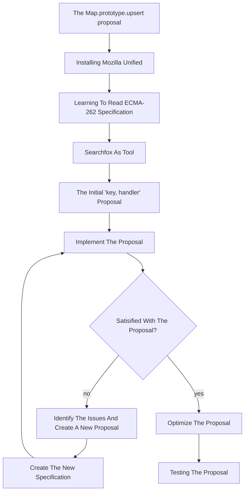

# Tutorial

### ECMAScript®

JavaScript™ is standardized by ECMAScript® and specified in the <a href="https://ecma-international.org/publications-and-standards/standards/ecma-262/" target="_blank">ECMA-262 language specification</a>, which is maintained by Ecma International through the <a href="https://tc39.es/" target="_blank">TC39 committee</a>. ECMAScript® defines the core features of the language, providing a standard that ensures consistency across different JavaScript™ engines. Major engines like <a href="https://v8.dev/" target="_blank">V8</a> (used in Chrome and Node.js), <a href="https://developer.apple.com/documentation/javascriptcore" target="_blank">JavaScriptCore</a> (Safari), and <a href="https://spidermonkey.dev/" target="_blank">SpiderMonkey,</a> (Firefox) implement these specifications, allowing developers to write code that behaves similarly across different environments.

SpiderMonkey, the engine developed by Mozilla, powers JavaScript™ execution in Firefox and supports the development of new language features. This tutorial focuses on working within SpiderMonkey to implement and test a new JavaScript™ proposal, providing insight into both the ECMAScript® standardization process and the inner workings of a JavaScript™ engine.

### Introduction

Welcome to this detailed tutorial on how to implement and understand the <a href="https://github.com/tc39/proposal-upsert" target="_blank">`Map.prototype.upsert proposal`</a>. This guide is tailored to help both beginners and advanced developers learn how to contribute to (JavaScript™) language development by implementing a new feature in SpiderMonkey, Mozilla's JavaScript™ engine. We’ll cover all the necessary steps, from downloading and setting up the development environment to writing the `upsert` method and testing it with the official test suite, <a href="https://github.com/tc39/test262" target="_blank">Test262</a>.


We'll start with an introduction to the `Map.prototype.upsert` proposal, highlighting its benefits for developers. From there, you'll be guided through setting up the development environment using Mozilla's SpiderMonkey JavaScript™ engine. You'll then implement the `upsert` method using both *self-hosted* JavaScript™ and (a little bit of) C++, ensuring alignment with the ECMAScript® specification. 

The main focus will initially be on developing a functional solution. Once basic functionality is verified, optimization techniques will be applied to ensure your code is efficient and performant. You'll also gain insight into contributing to the ECMAScript® standard, aligning your code with the best practises in the JavaScript™ community. Finally, you'll explore testing with Test262, the official ECMAScript® test suite, learning how to write custom tests to validate your implementation.

By the end of this tutorial, you'll have implemented a fully functional `upsert` method and gained valuable insight into the process of designing, testing and standardizing JavaScript™ features.

### What’s Covered in This Tutorial?

- __The `Map.prototype.upsert` Proposal:__ Learn what this proposal is, how it works, and why it’s beneficial for JavaScript™ developers.
- __Setting Up the Development Environment:__ How to download and build Mozilla Unified, the repository that contains SpiderMonkey.
- __Implementing the Proposal:__ We will implement the `upsert` method both in self-hosted JavaScript™ and C++.
- __Debugging and Testing:__ How to test your implementation using Test262, the official test suite for ECMAScript®, and how to run custom scripts.
- __Optimizing Your Code:__ Learn about performance considerations and optimizations.
- __Contributing to the ECMAScript® Standard:__ Understand how to write specification-compliant code and contribute to the broader ECMAScript® standard.



<details open>
   <summary><h2>The `Map.prototype.upsert` proposal</h2></summary>

   **What is it?**

   `Map.prototype.upsert` is a new method for JavaScript™'s `Map`-object. The operation simplifies the process of inserting or updating `key-value` pairs in the Map. The function simply checks for existence of a key to either `insert` or `update` new `key-value` pairs.

   **How does it work?**
   The `upsert` operation takes two arguments: a `key` and a `handler` object. The `handler` contains two properties:

* `update`: Function to modify `value` of a `key` if already present in the `Map`.
* `insert`: Function that generates a `default-value` to be set to the belonging `value` of the checked `key`.

   **The function follow these steps:**

   1. The `Map` is checked for the `key` passed as argument. If found:
       * It checks the `handler` for an `update` function. If found, this is used to `update` the `value` belonging to the passed `key`. After this, the newly updated entry will be returned. 
   2. If not found, the `insert` function from the `handler` is used to generate a new `value`. This will be assigned to the given `key` before returning it.
   3. In either case, the `value` will be the `return value` of the `upsert` method.

   **What is the motivation?** Adding and updating values of a `Map` are tasks that developers often perform in conjunction. There are currently no `Map` methods for either of those two things, let alone a method that does both. The workarounds involve multiple lookups and can be inconvenient for developers. It is also aiming to prevent code that might be confusing or lead to errors.

   <details>
   <summary>
   Either update or insert for a specific key
   </summary>

   Before:

   ```js
   // two lookups
   old = map.get(key);
   if (!old) {
     map.set(key, value);
   } else {
     map.set(key, updated);
   }
   ```

   Using upsert:

   ```js
   map.upsert(key, {
     update: () => updated,
     insert: () => value
   });
   ```

   </details>
   <details>
   <summary>
   Just insert if missing:
   </summary>

   Before:

   ```js
   // two lookups
   if (!map1.has(key)) {
     map1.set(key, value);
   }
   ```

   Using upsert:

   ```js
   map.upsert(key, {
     insert: () => value
   });
   ```

   </details>
   <details>
   <summary>
   Just update if present:
   </summary>

   Before:

   ```js
   // three lookups
   if (map.has(key)) {
     old = map.get(key);
     updated = old.doThing();
     map.set(key, updated);
   }
   ```

   Using upsert:

   ```js
    map.upsert(key, {
      update: (old) => old.doThing()
    });
   ```

   </details>

</details>

<details open>
   <summary><h2>Installing mozilla unified</h2></summary>

   In this section you will learn how to download the Mozilla environment based on your operating system. It will also feature setting up SpiderMonkey for development and introduce main tools which are used during development.

### 1. Installation of SpiderMonkey and required tools

  We will start by installing SpiderMonkey and all required tools.

  Before you start installing, open a terminal and navigate to the desired location of the `mozilla_unified` folder.

  The installation process depends on your operating system, therefore you can click on the link under that matches yours.

* <a href="https://firefox-source-docs.mozilla.org/setup/linux_build.html" target="_blank">Build Mozilla Firefox on Linux</a>
* <a href="https://firefox-source-docs.mozilla.org/setup/macos_build.html" target="_blank">Build Mozilla Firefox on Mac</a>
* <a href="https://firefox-source-docs.mozilla.org/setup/windows_build.html" target="_blank">Build Mozilla Firefox on Windows</a>

  
During the installation, you will be asked which version of Firefox you want to build as a standard. In this tutorial we will choose `5: SpiderMonkey JavaScript™ engine`, which will allow for faster builds during development.

It doesn't matter if you choose to use `hg` or `git` to grab the source code.

**Having trouble?**

<a href="https://firefox-source-docs.mozilla.org/setup/common_build_errors.html" target="_blank">Here</a> are some of the most common build errors. __Note!__ Many errors can be related to your Python build. Ensure you are using the correct python path and/or configuration.

### 2. Running SpiderMonkey

  After the installation is completed a folder named `mozilla-unified` should now appear in the folder your terminal was located when starting the guide above.

  Navigate into `mozilla-unified` folder using `cd mozilla_unified`.

  In order to run the SpiderMonkey engine, we first have to build it:

  ```sh
  ./mach build
  ```

  After executing this command the output should look something like this:

  ```sh
  Your build was successful!
  To take your build for a test drive, run: |mach run|
  ```
  
  In order to run the finished build, execute this command:

  ```sh
  ./mach run
  ```

  Your terminal should now enter the JavaScript™ Read-Eval-Print-Loop mode. 
  The functionality is similar to a browsers console and arbitrary JavaScript™ code can be executed. 

  ```sh
  js>
  ```

  This will be used to test our implementation throughout the tutorial.
  
  You can use it to write js-lines to evaluate. This will output `Hello World!` in the console:

  ```sh
  js> console.log("Hello World!");
  ```
  
  You can also execute `.js` files, which is done by giving the filename as a parameter in the `/mach run` command: 

  If you create a file called `helloworld.js` with `console.log("Hello World!);` in it and save it. You can execute it like this (given it is in the same folder):
  ```sh
  ./mach run helloworld.js
  ```

### 3. Applying simple changes

  Self-hosted code is located in `mozilla-unified/js/src/builtin`. Here we can edit, add or remove functions.

  To see the effect of this, we can change the `return value` of a function.

  Open file `Array.js` and change function `ArrayAt` to `return` 42.

  Test your changes by rebuilding and running the SpiderMonkey and then call the function with valid parameters.
  ```sh
    js> var l = [1,2,3];
    js> l.at(1);
    42
  ```

  Self-hosted code is a bit different to normal JavaScript™, given that you can effectively and easily edit/create functions you want.
  This can cause problems, more on this later.

</details>

<details open>
   <summary><h2>How to Read the ECMA-262 Language Specification</h2></summary>

### 1. What is the ECMA-262 Specification?

* <a href="https://262.ecma-international.org/15.0/index.html?_gl=1*chzpt6*_ga*Mzc5OTUzMzY4LjE3MjQzMjMwMjA.*_ga_TDCK4DWEPP*MTczMDcyMzg1Ni41LjEuMTczMDcyNDYxMy4wLjAuMA" target="_blank">ECMA-262</a> is the official document that defines how JavaScript™ works. It provides detailed guidelines for developers and browser vendors on how JavaScript™ should behave in every situation, ensuring consistency and compatibility across different platforms and implementations.

### 2. How to Navigate the Document

* **Start with the Table of Contents**: This is where you’ll find major sections like grammar, types, and functions. It helps you jump to the part you’re interested in.
* **Use Search**: The specification is large. If you’re looking for a specific topic, like `Promise` or `Array`, use your browser’s search function (`Ctrl + F`/`cmd + F`) to find it quickly.
* **Annexes (Extras)**: At the end of the document, you’ll find extra sections that explain older features or give additional context.

### 3. How to Read the Algorithms

* **Algorithms are like instructions**: The spec breaks down how JavaScript™ works using step-by-step instructions, almost like a recipe.
* **Steps to follow**: The specification breaks down methods like <a href="https://262.ecma-international.org/15.0/index.html?_gl=1*chzpt6*_ga*Mzc5OTUzMzY4LjE3MjQzMjMwMjA.*_ga_TDCK4DWEPP*MTczMDcyMzg1Ni41LjEuMTczMDcyNDYxMy4wLjAuMA#sec-array.prototype.push" target="_blank">`Array.prototype.push`</a> into clear, numbered steps. For instance, it describes how the method first checks the current `length`, then adds the new element, and finally updates the array's `length`.
* **Conditions**: You’ll often see `if`-statements, that will tell you how to proceed if the statement evaluates to `true` or `false`.

### 4. Some Key Symbols and What They Mean

* **`[[ ]]` (Double Brackets)**: These represent internal properties of JavaScript™ objects. These are properties that JavaScript™ uses internally but developers can’t directly access.
* **`?` (Question Mark)**: This shorthand means "if this operation results in an error (abrupt completion), `return` that error immediately." For example, `? Call(func, arg)` means that if calling `func` with `arg` throws an error, stop the current process and `return` the error right away.
* **`Return`**: This marks the end of an operation, specifying the result to be returned.
* **`{ }` (Curly braces)**: These are used to define a **Record** structure. A **Record** is a data structure that groups together related fields as `key-value` pairs. Each field is identified by a name (`key`) and stores a secific `value`. 
* **Keywords**: Keywords like `If`, `Else`, or `Else if` are represented as **algorithmic steps** in plain text, rather than in code syntax, to describe the behavior that an implementation should follow.

### 5. Finding Information on Other Symbols

The specification text uses a range of notations and symbols to describe its syntax and structure. To understand these symbols, you can look into this specific section in the specification:

* <a href="https://262.ecma-international.org/15.0/index.html?_gl=1*chzpt6*_ga*Mzc5OTUzMzY4LjE3MjQzMjMwMjA.*_ga_TDCK4DWEPP*MTczMDcyMzg1Ni41LjEuMTczMDcyNDYxMy4wLjAuMA#sec-notational-conventions" target="_blank">Notational Conventions</a>: This section explains the different types of symbols, and how they are used to define the language. 
* For example, in the <a href="https://262.ecma-international.org/15.0/index.html?_gl=1*chzpt6*_ga*Mzc5OTUzMzY4LjE3MjQzMjMwMjA.*_ga_TDCK4DWEPP*MTczMDcyMzg1Ni41LjEuMTczMDcyNDYxMy4wLjAuMA#sec-nonterminal-symbols-and-productions" target="_blank">Nonterminal Symbols and Productions</a> section, you can read about nonterminal symbol, which are shown in _italic type_, and learn how to read the syntactic definition of a **WhileStatement**. 

### 6. Start Simple

* Don’t dive into the complex parts immediately. Start by reading sections like the **Introduction** or common JavaScript™ features such as arrays or functions.
* **External Help**: Use resources like <a href="https://searchfox.org/" target="_blank">SearchFox.org</a> to browse and search for JavaScript™ engine implementations or additional explanations before checking the more technical spec.
* You can also check out https://timothygu.me/es-howto/ or https://v8.dev/blog/tags/understanding-ecmascript for other helpful guides on how to read the ECMA-262 Language Specification. 

### 7. Example: Understanding <a href="https://262.ecma-international.org/15.0/index.html?_gl=1*chzpt6*_ga*Mzc5OTUzMzY4LjE3MjQzMjMwMjA.*_ga_TDCK4DWEPP*MTczMDcyMzg1Ni41LjEuMTczMDcyNDYxMy4wLjAuMA#sec-array.prototype.push" target="_blank">`Array.prototype.push`</a>

* In the specification, you can search for `Array.prototype.push` to see how it works. The algorithm will explain:
  * First, the `length` of the array is checked.
  * Then, the new element is added to the array.
  * Finally, the `length` property is updated to reflect the added element.

## The `Map.prototype.upsert` Specification

This is the specification of the `Map.prototype.upsert` which will be implemented in this tutorial. This specification will guide our implementation, detailing each operation the `upsert` method needs to perform to insert or update a `key-value` pair in a `Map` object.

```lua
1. Let M be the this value.
  2. Perform ? RequireInternalSlot(M, [[MapData]]).
  3. Let entries be the List that is M.[[MapData]].
  4. For each Record { [[Key]], [[Value]] } e that is an element of entries, do
    4a. If e.[[Key]] is not empty and SameValueZero(e.[[Key]], key) is true, return e.[[Value]].
      4ai. If HasProperty(handler, "update") is `true`, then
        4ai1. Let updateFn be ? Get(handler, "update").
        4ai2. Let updated be ? Call(updateFn, handler, « e.[[Value]], key, M »).
        4ai3. Set e.[[Value]] to updated.
      4aii. Return e.[[Value]].
  5. Let insertFn be ? Get(handler, "insert").
  6. Let inserted be ? Call(insertFn, handler, « e.[[Value]], key, M »).
  7. Set e.[[Value]] to inserted.
  8. Return e.[[Value]].
```

An html version of the specification can be found <a href="https://bldl.github.io/upsert-tutorial/initial-emplace-spec/Map.prototype.emplace.html" target="_blank">here.</a>

The ECMAScript 262 specification text can look intimidating at first glance. Before starting the implementation, try to get a rough understanding of what each line in the spec means. Write pseudocode, sentences or a combination. 
The aim is to develop a clear understanding of the functionality we want to achieve.

**Key Points to Focus On:**

- __Scope and Validation:__ The first few lines establish the `this value` (`M`) and ensure it’s a valid instance of `Map`.
- __Iterating Over Entries:__ The method iterates through the `Map` entries to check if the specified `key` already exists.
- __Conditional Update or Insert:__ If the key exists, it checks for an `update` function in the `handler` and applies it to update the `value`. If the key does not exist, it uses the `insert` function to create a new entry.
- __Returning the Result:__ Finally, it returns the updated or inserted `value`.

By breaking down the specification in this way, you'll have a roadmap for implementing each part of the `upsert` method. This approach will help make the implementation process smoother and ensure that you understand how each step contributes to the overall functionality.

**Rewrite the spec in your own words**
Example: 
3. Let __entries__ be the `List` that is __M__.[[MapData]].
-->>
3. make a `List` variable __entries__, which stores pairs `(key, value)`

In the implementation part of this tutorial, each line of the specification will be explained.

</details>

<details open>
   <summary><h2>Searchfox</h2></summary>

  <a href="https://searchfox.org/" target="_blank">Searchfox</a> is a helpful tool. Searchfox provides an indexed view of the source code, allowing developers to efficiently search for specific files, functions, or keywords. For instance, you can trace the implementation of existing JavaScript™ features, see how certain functions interact with SpiderMonkey’s internal data structures, or find how built-in JavaScript™ objects like `Map` are handled. SearchFox helps you navigate a seemingly endless and confusing codebase.

  When Implementing the `upsert` proposal, you will find that looking at existing implementations of similar functionality is often a good starting point. Combine the ECMA-262 Specification with Searchfox and look at existing code.

  Example workflow:

  1. *some line from the specification*.
  2. Find some other function with the same or similar spec line in the ECMA-262 specification.
  3. Look up the function in Searchfox.
  4. Borrow from the other function.

</details>

<details open>
   <summary><h2>Implementation</h2></summary>

  In this section, we’ll walk through the process of implementing the `Map.prototype.upsert` method step-by-step. We will examine each line of the specification in detail and you will gain a deep understanding of the implementation process. By the end, you’ll have a fully functional `upsert` method in JavaScript™, along with insight in where to find resources and information which gives you a strong foundation to implement additional functions on your own in the future.

### Creating a function

  The first step to implementing a function in SpiderMonkey is to create a *hook* in C++. This hook serves as the connection between SpiderMonkey’s C++ core and our self-hosted JavaScript™ code.

  The JavaScript™ type `Map` is defined in C++ as `MapObject`. All `Map` methods, like `Map::set` and `Map::get`, are defined 
  in the array `MapObject::methods[]`. To add `upsert` we need to define a hook in this array.
  
  __Create a hook in `MapObject.cpp`:__

  ```cpp

    JS_SELF_HOSTED_FN("upsert", "MapUpsert", 2,0),
  
  ```

  This line sets up the hook with the following details:

  - __JS_SELF_HOSTED_FN:__ Indicates the function is implemented in self-hosted JavaScript™ (meaning the main logic is in JavaScript™ rather than C++).
  - __First argument:__ `upsert` — the function name as it will appear in JavaScript™.
  - __Second argument:__ `MapUpsert` — the name of the JavaScript™ implementation (which we’ll define shortly)
  - __Third argument:__ `2` Number of arguments.
  - __Fourth argument:__ `0` Number of flags.

  __Copy the line above and paste it into `MapObject.cpp` under `MapObject::Methods`__

  With the C++ hook in place, we can define the actual function in JavaScript™. Open `Map.js`, and add the following code:

   ```js
   function MapUpsert(key, handler) {
     return 42
   }
   ```

  This is a simple placeholder function. It doesn’t perform any `upsert` logic yet; it just returns the number 42. This step allows us to check that our function is correctly hooked up and accessible in the JavaScript™ runtime.

  To confirm everything is connected, build the project and run the JavaScript™ shell:

  ```sh
  ./mach build
  ...
  ./mach run
  ```

  Once the shell opens, you can test your upsert function:

  ```sh
  js> const m = new Map()
  js> m.upsert(0,0)
  42
  ```

  If you see 42 as the output, then you’ve successfully created a function hook and defined an initial JavaScript™ implementation. This means we’re ready to move forward with implementing the actual `upsert` functionality.


### Step 1 - Implement The First Line

  Now that we have our `upsert` method hooked up and accessible in the JavaScript™ runtime, it’s time to start implementing the logic as specified in the ECMAScript® proposal.

  **Setting Up this in the Function**
  Some lines in the specification are more intutive than others. The first line of the specification instructs us to capture the current `this` context, which is the `MapObject` instance on which `upsert` was called. This is a foundational step in almost any method, as it ensures we’re working with the correct object.

  **Specification Line:**

  ```lua
  1. Let M be the this value.
  ```

  In the code, we can implement this line simply by assigning this to a variable called `M`. This will allow us to refer to the `Map` instance consistently throughout the function: 

  ```js
  function MapUpsert(key, handler) {
    var M = this;
  }
  ```

  We have now captured the `this` object, which should be an instance of a `MapObject` and we can now start to manipulate this object in the upcomming steps.

### Step 2 - Verify The Object Type

  With the `this` context now captured in `M`, our next step is to validate that `M` is actually a `MapObject`. This is crucial because JavaScript™ objects can sometimes be altered or misused, and we need to ensure that `upsert` is being called on a valid instance of `Map`. This verification process will prevent errors and misuse, keeping the method consistent with the ECMAScript® specification.

  **Verifying the Map’s Internal Structure**  
  The ECMAScript® specification uses internal slots to define hidden properties within objects. In this step, we’re asked to confirm that the object `M` has the `[[MapData]]` internal slot, which holds the actual `key-value` data for the `Map`. By checking for this internal slot, we can be confident that `M` is indeed a `Map` and not some other type of object.

  __Specification Line:__

   ```lua
   2. Perform ? RequireInternalSlot(M, [[MapData]]).
   ```
   
   This step is common for most self-hosted `MapObject` methods. The solution for this step already exists in the code. Look at `MapForEach` as an example.


   <details>
   <summary>Solution</summary>

   ```js
   function MapUpsert(key, handler) {
     var M = this;
   
     if (!IsObject(M) || (M = GuardToMapObject(M)) === null) {
       return callFunction(
         CallMapMethodIfWrapped,
         this,
         key,
         handler,
         "MapUpsert"
       );
     }
   }
   ```

   </details>


### Step 3 - Self-Hosted JavaScript™ vs. JavaScript™

  Before we proceed further in the tutorial it's imperitive to better our understanding of self-hosted JavaScript™. 

  All self-hosted JavaScript™ operates in __strict mode,__ preventing functions from running in the global scope if invoked with a `null` or `undefined` scope. To make self-hosted JavaScript™ safe,
  we have to follow some rules. A potentially critical problem when writing self-hosted code is __monkey patching.__ This phenomenom occurs when our implementation makes a function call to an external function
  which has been overwritten by user scripts. This problem can be mitigated by using __function invocation.__ Use `callFunction` and `callContentFunction` to call function within the specific object scope. 
  Furthermore, self-hosted code also has limited access to the C++ builtins. Only a select set, defined in `Selfhosting.cpp` is accessible. 

  **What functions can be used in self-hosted JavaScript™?**

  - Other self-hosted functions (remember 'almost' everything is an `Object`).
  - Functions made accessible in `SelfHosting.cpp`.
  - Some abstract operations and additional utility functions.


  Read more about self-hosted code <a href="https://udn.realityripple.com/docs/Mozilla/Projects/SpiderMonkey/Internals/self-hosting" target="_blank">here.</a>
  
  __The snippet below is from `SelfHosting.cpp` and displays the available `MapObject` builtins:__

  ```cpp

  // Standard builtins used by self-hosting.
  // Code snippet from SelfHosting.cpp
  ...
    JS_FN("std_Map_entries", MapObject::entries, 0, 0),
    JS_FN("std_Map_get", MapObject::get, 1, 0),
    JS_FN("std_Map_set", MapObject::set, 2, 0),
  ...

  ```

  **Moving on with the implementation**
  We have stored the `this` object and verified that is infact an instance of `MapObject`. In the coming steps, the contents of this object will be manipulated. The next step tells us to store the contents of the `Map` as a `List`.

  __Specification Line:__

  ```lua
  3. Let entries be the List that is M.[[MapData]].
  ```

  Use `callFunction` and the standard built-in `std_Map_entries` to retrive a list of all `key-value` entries in the `Map`. Store it as a variable named `entries`.

   <details>
   <summary>Solution</summary>

   ```js
   function MapUpsert(key, handler) {
     var M = this;
   
     if (!IsObject(M) || (M = GuardToMapObject(M)) === null) {
       return callFunction(
         CallMapMethodIfWrapped,
         this,
         key,
         handler,
         "MapUpsert"
       );
     }
   
     var entries = callFunction(std_Map_entries, M);
   }
   ```

   </details>

### Step 4 - iterating through the map entries

  Now that we’ve set up our initial structure and verified our `MapObject`, the next step is to iterate through the entries within the `Map`. This allows us to examine each `key`-`value` pair to determine 
  if the specified `key` already exists, which will help us decide whether to update an existing `value` or `insert` a new one. To achieve this we first have to set up an iteration of the `entries` list.

  __Specification Line:__

   ```
   4. For each Record { [[Key]], [[Value]] } e that is an element of entries, do
   ```

  Different methods of iteration is used in the other self-hosted `Map` methods. The specification states that we should use a `for-of loop`. Look at existing methods and create the for-loop.  

   <details>
   <summary>Solution</summary>

   ```js
   function MapUpsert(key, handler) {
     var M = this;
   
     if (!IsObject(M) || (M = GuardToMapObject(M)) === null) {
       return callFunction(
         CallMapMethodIfWrapped,
         this,
         key,
         handler,
         "MapUpsert"
       );
     }
   
     var entries = callFunction(std_Map_entries, M);
   
     for (var e of allowContentIter(entries)) {
       var eKey = e[0];
       var eValue = e[1];
       //...
     }
   }
   ```

   </details>

  **Check if `key` already exists**

  As mentioned above, the purpose of the iteration is to check wether or not the key already exists. This can be done by comparing the `key` with `eKey`.

  __Specification Line:__

   ```lua
   4a. If e.[[Key]] is not empty and SameValueZero(e.[[Key]], key) is true, then
   ```

  The `SameValueZero` function helps us check for equality between the `key` provided to `MapUpsert` and the `key` in the current entry. This comparison ensures that we handle only the correct `key`-`value` pair.

   <details>
   <summary>Solution</summary>

   ```js
   function MapUpsert(key, handler) {
     var M = this;
   
     if (!IsObject(M) || (M = GuardToMapObject(M)) === null) {
       return callFunction(
         CallMapMethodIfWrapped,
         this,
         key,
         handler,
         "MapUpsert"
       );
     }
   
     var entries = callFunction(std_Map_entries, M);
   
     for (var e of allowContentIter(entries)) {
       var eKey = e[0];
       var eValue = e[1];
       
       if (SameValueZero(key, eKey)) {
         //...
       }
     }
   }
   ```

   </details>

   If the `SameValueZero` operation returns `true` on an entry, the `key` exists in the `Map`. By logic of the specification, we cannot insert on an existing `key`-`value` pair, but we can `update` it this function exists in the `handler`.

  **Check for the `update` handler**

  With the `key` identified in the `Map`, the next step is to determine if the `handler` object includes an `update` function. This will allow us to `update` the `value` associated with the existing `key` in the `Map`.

  __Specification Line:__

   ```lua
   4ai. If HasProperty(handler, "update") is `true`, then
   ```

  In self-hosted JavaScript™, most objects are treated similarly to regular JavaScript™ objects, so we can use standard object methods for these checks. For example, `hasOwnProperty` can verify if `update` is a property of `handler`. 
   
  Here’s a snippet from the `Object.cpp` file displaying some self-hosted functions:

   ```cpp
   // Code snippet from Object.cpp
   static const JSFunctionSpec object_methods[] = {
       //...
       JS_SELF_HOSTED_FN("toLocaleString", "Object_toLocaleString", 0, 0),
       JS_SELF_HOSTED_FN("valueOf", "Object_valueOf", 0, 0),
       JS_SELF_HOSTED_FN("hasOwnProperty", "Object_hasOwnProperty", 1, 0),
       //...
       JS_FS_END,
   };
   ```

  Using `hasOwnProperty` on `handler`, we can now verify if the `update` property is defined. This step ensures that we only proceed if `handler` actually provides an `update` function.

   <details>
   <summary>Solution</summary>

   ```js
   function MapUpsert(key, handler) {
     var M = this;
   
     if (!IsObject(M) || (M = GuardToMapObject(M)) === null) {
       return callFunction(
         CallMapMethodIfWrapped,
         this,
         key,
         handler,
         "MapUpsert"
       );
     }
   
     var entries = callFunction(std_Map_entries, M);
   
     for (var e of allowContentIter(entries)) {
       var eKey = e[0];
       var eValue = e[1];
       
       if (SameValueZero(key, eKey)) {
         if (callFunction(Object_hasOwnProperty, handler, 'update')) {
           //...
         }
       }
     }
   }
   ```

   </details>

  **Get the `update` function from the `handler`**
  
  If the `key` exists and `update` is specified, the next step is to retrive the `update` function.

  __Specification Line:__

   ```lua
   4ai1. Let updateFn be ? Get(handler, "update").
   ```

  Store the `update` function as a variable `updateFn`.

   <details>
   <summary>Solution</summary>

   ```js
   function MapUpsert(key, handler) {
     var M = this;
   
     if (!IsObject(M) || (M = GuardToMapObject(M)) === null) {
       return callFunction(
         CallMapMethodIfWrapped,
         this,
         key,
         handler,
         "MapUpsert"
       );
     }
   
     var entries = callFunction(std_Map_entries, M);
   
     for (var e of allowContentIter(entries)) {
       var eKey = e[0];
       var eValue = e[1];
       
       if (SameValueZero(key, eKey)) {
         if (callFunction(Object_hasOwnProperty, handler, 'update')) {
           var updateFN = handler['update'];
           //...
         }
       }
     }
   }
   ```

  **Call the update function**

  Now that we’ve verified the existence of an `update` function in the `handler` object, the next step is to invoke this function to get the `updated` `value`.

  __Specification Line:__

   </details>

   ```lua
   4ai2. Let updated be ? Call(updateFn, handler, « e.[[Value]], key, M »).
   ```

  In this context, we need to call the `update` function on the current value associated with the `Map` entry. This involves passing `e.[[Value]]` (the existing `value`), `key`, and `M` as arguments to the function.

  To perform this function call in self-hosted JavaScript™, we’ll use `callContentFunction`, to call `updateFn` with `M` as the scope and `eValue` (the existing `value`) and `key` as the arguments. The result of this call should be stored as `var updated`, which we’ll then use to update the `Map` entry. Why use `callContentFunction` instead of `callFunction`? `callFunction` is faster than `callContentFunction`, however the latter is safer with respect to user content. Since the `handler` object is passed by the user, `callContentFunction` is reasonable. A more detailed explaination <a href="https://udn.realityripple.com/docs/Mozilla/Projects/SpiderMonkey/Internals/self-hosting" target="_blank">here.</a>

   <details>
   <summary>Solution</summary>

   ```js
   function MapUpsert(key, handler) {
     var M = this;
   
     if (!IsObject(M) || (M = GuardToMapObject(M)) === null) {
       return callFunction(
         CallMapMethodIfWrapped,
         this,
         key,
         handler,
         "MapUpsert"
       );
     }
   
     var entries = callFunction(std_Map_entries, M);
   
     for (var e of allowContentIter(entries)) {
       var eKey = e[0];
       var eValue = e[1];
       
       if (SameValueZero(key, eKey)) {
         if (callFunction(Object_hasOwnProperty, handler, 'update')) {
           var updateFN = handler['update'];
           var updated = callContentFunction(updateFN, M, eValue, key);
           //...
         }
       }
     }
   }
   ```

   </details>

  **Update the `value` in the `Map`**

  Once we have the `updated` `value` from calling the `update` function, we can proceed to replace the current `value` in the map entry.

  __Specification Line:__

   ```lua
   4ai3. Set e.[[Value]] to updated.
   ```

  This step involves using the `std_Map_set` function, a standard self-hosted operation that allows us to safely set a new `value` for a specified `key` in the `Map`. Since `std_Map_set` is a built-in function available to self-hosted code, we’ll call it to update the entry with our newly computed `updated` `value`.

   **Recall the standard built-in map operations specified in `SelfHosting.cpp`:**

   ```cpp
   // Standard builtins used by self-hosting.
   // Code snippet from SelfHosting.cpp
       JS_FN("std_Map_entries", MapObject::entries, 0, 0),
       JS_FN("std_Map_get", MapObject::get, 1, 0),
       JS_FN("std_Map_set", MapObject::set, 2, 0),
   ```

   Use `callFunction` and `std_Map_entries` to set the new `value`.

   <details>
   <summary>Solution</summary>

   ```js
   function MapUpsert(key, handler) {
     var M = this;
   
     if (!IsObject(M) || (M = GuardToMapObject(M)) === null) {
       return callFunction(
         CallMapMethodIfWrapped,
         this,
         key,
         handler,
         "MapUpsert"
       );
     }
   
     var entries = callFunction(std_Map_entries, M);
   
     for (var e of allowContentIter(entries)) {
       var eKey = e[0];
       var eValue = e[1];
       
       if (SameValueZero(key, eKey)) {
         if (callFunction(Object_hasOwnProperty, handler, 'update')) {
           var updateFN = handler['update'];
           var updated = callContentFunction(updateFN, M, eValue, key);
           callFunction(std_Map_set, M, key, updated);
         }
       }
     }
   }
   ```

  **`Return` the `value`**

  We have now `updated` the `value`, and can `return` it.

  __Specification Line:__

   </details>

   ```lua
   4aii. Return e.[[Value]].
   ```

  `return` the `updated` `value`.

   <details>
   <summary>Solution</summary>

   ```js
   function MapUpsert(key, handler) {
     var M = this;
   
     if (!IsObject(M) || (M = GuardToMapObject(M)) === null) {
       return callFunction(
         CallMapMethodIfWrapped,
         this,
         key,
         handler,
         "MapUpsert"
       );
     }
   
     var entries = callFunction(std_Map_entries, M);
   
     for (var e of allowContentIter(entries)) {
       var eKey = e[0];
       var eValue = e[1];
       
       if (SameValueZero(key, eKey)) {
         if (callFunction(Object_hasOwnProperty, handler, 'update')) {
           var updateFN = handler['update'];
           var updated = callContentFunction(updateFN, M, eValue, key);
           callFunction(std_Map_set, M, key, updated);
         }
   
         return callFunction(std_Map_get, M, key);
       }
     }
   }
   ```

   </details>

### Step 5 - Implementing The `Insert` Handler

  In this step, we’ll handle the scenario where the specified `key` doesn’t exist in the `Map`.

  __The Specification States__

   ```lua
   5. Let insertFn be ? Get(handler, "insert").
   6. Let inserted be ? Call(insertFn, handler, « e.[[Value]], key, M »).
   7. Set e.[[Value]] to inserted.
   8. Return e.[[Value]].
   ```

  This section is similar to our approach for updating an existing entry, except here, we’re adding a new entry to the `Map`. If the `key` isn’t found, we retrieve the `insert` function from the `handler` and invoke it to generate the initial `value` for this new `key`-`value` pair.

  The section uses similar techniques to the `update` scenario. Use the knowledge and experience you have gained so far to implement the `insert` handler.

   <details>
   <summary>Solution</summary>

   ```js
   function MapUpsert(key, handler) {
     var M = this;
   
     if (!IsObject(M) || (M = GuardToMapObject(M)) === null) {
       return callFunction(
         CallMapMethodIfWrapped,
         this,
         key,
         handler,
         "MapUpsert"
       );
     }
   
     var entries = callFunction(std_Map_entries, M);
   
     for (var e of allowContentIter(entries)) {
       var eKey = e[0];
       var eValue = e[1];
       
       if (SameValueZero(key, eKey)) {
         if (callFunction(Object_hasOwnProperty, handler, 'update')) {
           var updateFN = handler['update'];
           var updated = callContentFunction(updateFN, M, eValue, key);
           callFunction(std_Map_set, M, key, updated);
         }
   
         return callFunction(std_Map_get, M, key);
       }
     }
   
     var insertFN = handler['insert'];
     var inserted = callFunction(insertFN, key, M);
     callFunction(std_Map_set, M, key, inserted);
   
     return callFunction(std_Map_get, M, key);
   }
   ```

   </details>

  ### Test the implementation

  Now that we have implemented the function, it's essential that we test it to verify it behaves as intended.

  Recall, you can create files and run them with the command:

  ```sh
  ./mach run MyFileName.js
  ```

  Create a script to test your implementation or use the sample script below:

  <details>
    <summary>Script</summary>

   ```js
  console.log("Running tests for Map.prototype.upsert proposal...");

  // Utility function for logging test results
  function logResult(testName, actual, expected) {
      console.log(`Test: ${testName}`);
      console.log(`Expected: ${expected}`);
      console.log(`Actual: ${actual}`);
      console.log(actual === expected ? "Passed" : "Failed");
      console.log('------------------------------');
  }

  // Test 1: Update on existing key
  (function testUpdateExistingKey() {
      const m = new Map();
      m.set("key", "val");

      m.upsert("key", {
          update: () => "updated"
      });

      logResult("Update on existing key", m.get("key"), "updated");
  })();

  // Test 2: Insert on existing key (should not change existing value)
  (function testInsertExistingKey() {
      const m = new Map();
      m.set("key", "val");

      m.upsert("key", {
          insert: () => "inserted"
      });

      logResult("Insert on existing key (no change)", m.get("key"), "val");
  })();

  // Test 3: Insert and update on existing key
  (function testInsertAndUpdateExistingKey() {
      const m = new Map();
      m.set("key", "val");

      m.upsert("key", {
          update: () => "updated",
          insert: () => "inserted"
      });

      logResult("Insert and update on existing key", m.get("key"), "updated");
  })();

  // Test 4: Update nonexistent key (should not update, no effect)
  (function testUpdateNonexistentKey() {
      const m = new Map();

      try {
          m.upsert("nonexistent", {
              update: () => "updated"
          });
      } catch (e) {
          console.log("Test: Update nonexistent key");
          console.log("Expected Error: " + e.message);
          console.log('------------------------------');
      }

  })();

  // Test 5: Insert nonexistent key
  (function testInsertNonexistentKey() {
      const m = new Map();

      m.upsert("nonexistent", {
          insert: () => "inserted"
      });

      logResult("Insert nonexistent key", m.get("nonexistent"), "inserted");
  })();

  // Test 6: Insert and update nonexistent key (insert should happen)
  (function testInsertAndUpdateNonexistentKey() {
      const m = new Map();

      m.upsert("nonexistent", {
          update: () => "updated",
          insert: () => "inserted"
      });

      logResult("Insert and update nonexistent key", m.get("nonexistent"), "inserted");
  })();

  // Test 7: Increment counter twice
  (function testIncrementCounter() {
      const counter = new Map();

      counter.upsert("a", {
          update: (v) => v + 1,
          insert: () => 1
      });
      logResult("Increment counter first time", counter.get("a"), 1);

      counter.upsert("a", {
          update: (v) => v + 1,
          insert: () => 1
      });
      logResult("Increment counter second time", counter.get("a"), 2);
  })();


   ```
  </details>


</details>

<details open>
   <summary><h2>Issues with the original proposal</h2></summary>

The proposal we have dealt with so far introduced a flexible solution by allowing both an `update` and an `insert` function, which added unnecessary complexity to the usage of `upsert`. Flexibility is generally a good thing. However in the case of `Map.prototype.upsert`, the flexibility comes at the expense of simplicity and ease of use, which is very important for widespread adoption in programming languages.

The process of checking if a `key` exists and then inserting it if not, is likely the primary, in-demand use case for this method. By following the steps of this proposal, the process became unnecessarily complicated. Most developers typically just need to insert a `value` if the given `key` is missing, rather than having to provide sepreate logic for both `insert` and `update`. 

In additon, the approach of the original proposal don't align well with common practices in other known programming languages. An example which offers a similar and simpler functionality is seen in Python and is called <a href="https://docs.python.org/2/library/stdtypes.html#dict.setdefault" target="_blank">`setdefault`</a>. You can read more about this method in the next section of the tutorial.

By making it overcomplicated and a feature that is not commonly found in other languages, the method is at risk at being underutilized. Reducing the scope to a more straightforward function makes it more intuitive and more likely to be used effectively. 

</details>

<details open>
   <summary><h2>Explaining the new proposal</h2></summary>

  The new <a href="https://github.com/tc39/proposal-upsert" target="_blank">proposal</a> presents the idea of implementing two different versions. 

  (1) Takes the arguments `key` and `value`. 

  (2) Takes the the arguments `key` and `callbackfn`

  Both the respective versions with `value` and `callbackfn` serves the same principle as a `get` or `insert` if missing method on the `MapObject`. For the remainder of this tutorial we will focus on the `upsert(key, value)` version.


   **What is the motivation for a new propsosal?**
   A common problem when using a `Map` is how to handle doing a `Map` entry when you're not sure if the `key` already exists in the `Map`. This can be handled by first checking if the `key` is present, and then inserting or updating depending upon the result, but this is both inconvenient for the developer, and less than optimal, because it requires multiple lookups in the `Map` that could otherwise be handled in a single call.

   **What is the solution?**
   A method that will check whether the given `key` already exists in the `Map`. If the `key` already exists, the `value` associated with the `key` is returned. Otherwise the new `key-value` pair is inserted in to the `Map`, before returning the newly input `value`.

   **Simple use of "new" upsert:**

   ```js
    // Currently
    let prefs = new getUserPrefs();
    if (prefs.has("useDarkmode")) {
        let darkMode = prefs.get("useDarkmode");
    }
    else {
        prefs.set("useDarkmode", true);
        darkMode = true; //Default value
    }
    
    // Using upsert
    let prefs = new getUserPrefs();
        prefs.upsert("useDarkmode", true); // Default to true
   ```

By using `upsert`, default values can be applied at different times, with the assurance that later defaults will not overwrite an existing `value`. This is obviously because the `key` already exists and will `return` the existing `key` instead of inserting or overwriting.

<details>
<summary>
Similar functionality in Python
</summary>
As mentioned earlier in this tutorial, there are similar functionalities in other languages such as Python and its setdefault method. In our case we use upsert on Map's. The setdefault method is used on dictionaries, lets use a similar code example:

```python
# Without setdefault
prefs = {}
if "useDarkmode" not in prefs : 
  prefs["useDarkmode"] = True # Default value

dark_mode = prefs["useDarkmode"]
```

```python
# Using setdefault
prefs = {}
prefs.setdefault("useDarkmode", True)
```

</details>

To implement the updated proposal, we first need to adapt the specification. 

## A Draft of The New Specification For The Proposal.

The new specification now looks like this. It draws similarities from the old specification and adapts to the newly specified behaviour we seek in the `Map.prototype.upsert` method.

  ```lua
  1. Let M be the this value.
  2. Perform ? RequireInternalSlot(M, [[MapData]]).
  3. Let entries be the List that is M.[[MapData]].
  4. For each Record { [[Key]], [[Value]] } e that is an element of entries, do
    4a. If e.[[Key]] is not empty and SameValueZero(e.[[Key]], key) is true, return e.[[Value]].
  5. Set e.[[Value]] to value.
  6. Return e.[[Value]].
  ```

  The next section will be based on this draft of the new specification. Later in the tutorial we will look into how we can write the specification in ecmarkup.

  An html version of the specification can be found <a href="https://bldl.github.io/upsert-tutorial/key-value-callback-spec/Map.prototype.getOrInsert.html" target="_blank">here.</a>

</details>

<details open>
  <summary><h2>Implementing the new proposal</h2></summary>

  In this section, we will adapt our implementation to match the updated proposal specification. Fortunately, some of the logic from the previous implementation can be reused. Our goal here is to keep the code clean and efficient by making only the necessary adjustments.

  ### Step 1-4 - the logic remains the same

  The first four steps remain unchanged from the original proposal.

  __The Specification States:__

  ```lua
  1. Let M be the this value.
  2. Perform ? RequireInternalSlot(M, [[MapData]]).
  3. Let entries be the List that is M.[[MapData]].
  4. For each Record { [[Key]], [[Value]] } e that is an element of entries, do
  ```

  These lines are similar to the previous proposal specification and they remain seemingly unchanged. Only a few altercations are introduced. We need to update the argument `handler` to `value`.

  <details>
    <summary>Solution</summary>

```js

function MapUpsert(key, value) {
  var M = this;

  if (!IsObject(M) || (M = GuardToMapObject(M)) === null) {
    return callFunction(
      CallMapMethodIfWrapped,
      this,
      key,
      value,
      "MapUpsert"
    );
  }

  var entries = callFunction(std_Map_entries, M);

  for (var e of allowContentIter(entries)) {
    var eKey = e[0];
    var eValue = e[1];

    //...
  }
}

```

We are now ready to proceed and update the logic of the function.

  </details>

  ### Step 4a - If the key exists, return the value

  In this step, we implement the condition to handle the case when the `key` already exists in the `Map`.

  __Specification Line:__

  ```lua
  4a. If e.[[Key]] is not empty and SameValueZero(e.[[Key]], key) is true, return e.[[Value]].
  ```

In the updated logic, we are only concerned with returning the existing `value` if the `key` is found, rather than handling updates. This is a streamlined approach that differs from our previous implementation.

Use the built-in `std_Map_get` function to `return` the existing `value`.

  <details>
    <summary>Solution</summary>

```js

function MapUpsert(key, value) {
  var M = this;

  if (!IsObject(M) || (M = GuardToMapObject(M)) === null) {
    return callFunction(
      CallMapMethodIfWrapped,
      this,
      key,
      value,
      "MapUpsert"
    );
  }

  var entries = callFunction(std_Map_entries, M);

  for (var e of allowContentIter(entries)) {
    var eKey = e[0];
    var eValue = e[1];

    if (SameValueZero(eKey, key)) {
      return callFunction(std_Map_get, M, key);
    }
  }
}

```

With this code in place, our `MapUpsert` function will `return` the existing `value` if the `key` is found in the `Map`. If the `key` does not exist, the function will continue to the next steps, where we will handle inserting a new entry.

  </details>

  ### Step 5 & 6 - insert the new key value pair

  Now, we address the scenario where the `key` does not already exist in the `Map`. If the specified `key` is not found in the previous iteration step, `insert` the new `value` and `return` it.

  __The Specification States:__
  
  ```lua
  5. Set e.[[Value]] to value.
  6. Return e.[[Value]].
  ```

  In this case, we will add the new `key`-`value` pair to the `Map` and then `return` the `value`. We can achieve this by using the built-in `Map::set` method, which allows us to add entries directly and efficiently.

  <details>
    <summary>Solution</summary>

```js
function MapUpsert(key, value) {
  var M = this;

  if (!IsObject(M) || (M = GuardToMapObject(M)) === null) {
    return callFunction(
      CallMapMethodIfWrapped,
      this,
      key,
      value,
      "MapUpsert"
    );
  }

  var entries = callFunction(std_Map_entries, M);

  for (var e of allowContentIter(entries)) {
    var eKey = e[0];
    var eValue = e[1];

    if (SameValueZero(eKey, key)) {
      return callFunction(std_Map_get, M, key);
    }
  }

  callFunction(std_Map_set, M, key, value);

  return value;
}
```

  </details>

With these fairly simple steps our new implementation is now more streamlined with a simpler and more attractive api.
  
</details>

<details open>
    <summary><h2>Writing the new spec in ecmarkup</h2></summary>
  
  In this section, we will cover how to install and use Ecmarkup to write specifications for proposals. 
  Ecmarkup is a markup language that is designed for technical specifications. 
  This allows the authors to visualize and format complex algorithms, clauses and terms in a way that is both readable and structured. 
  Regarding JavaScript-proposals, Ecmarkup provides a solid framework to document new algorithms or implementations so they align with the ECMAScript®-standards. 

  We will start with setting up the necessary tools to be able to use Ecmarkup, such as Node.js and Ecmarkup itself. 
  Furthermore, we will check out how to format specification using Ecmarkup before guiding you through how to build your specification into a HTML document. 

* **Installing Node.js and Node Package Manager**

    <details>
    <summary>
    <b>Windows</b>
    </summary>

    1. First go to Node.js official website (<https://nodejs.org/en>), and download the Windows Installer (recommended version).

    2. Run the installer and follow the instructions (make sure to check the box that says "Automatically install necessary tools").

    3. Verify installation by opening Command Prompt and typing:

    ```sh
    node -v
    npm -v
    ```
  This should return the versions of Node.js and npm.

    </details>

    <details>
    <summary><b>Mac</b></summary>

    1. Open Terminal
    2. Install Node.js via Homebrew by running the following command:
    ```sh
    brew install node
    ```
    3. Verify installation by typing:
    ```sh
    node -v
    npm -v
    ```
    </details>

    <details>
    <summary><b>Linux</b></summary>

    1. Open Terminal
    2. Update your package list:

    ```sh
    sudo apt update
    ```

    3. Install Node.js by running:
    ```sh
    sudo apt install node.js spm
    ```

    4. Verify the installation:
    ```sh
    node -v
    npm -v
    ```
    </details>


* **Installing <a href="https://tc39.es/ecmarkup/" target="_blank">Ecmarkup</a>**
    * Windows/Mac/Linux
        1. Open Command Prompt (Windows) or Terminal (Mac/Linux)
        2. Run the following command to install Ecmarkup globally:
      ```sh
      npm install -g ecmarkup
      ```
        3. Verify that Ecmarkup has been installed by typing:
      ```sh
      ecmarkup --version
      ```
      You have now installed Ecmarkup.

* **How to write ecmarkup**

  Ecmarkup is a markup language used for writing technical spesifications. It has a syntax similar to `HTML`, making it intuitive for those familiar with web development. Here's a simple example of what an algorithm in a `.emu` file looks like (`.emu` is the file ending of an ecmarkup file):

  ```html
  <!DOCTYPE html>
  <meta charset="utf8">
  <link rel="stylesheet" href="https://cdnjs.cloudflare.com/ajax/libs/highlight.js/8.4/styles/github.min.css">
  <script src="./spec.js"></script>
  <pre class="metadata">
  title: Your Document Title
  stage: The proposals stage
  contributors: Your name
  </pre>

  <emu-clause id="sec-greater-than-five">
    <h1>greaterThanFive(_value_)</h1>
    <p>When the greaterThanFive method is called, the following steps are taken:</p>
    <emu-alg>
      1. Let _x_ be _value_.
      1. If Type(_x_) is not Number, throw a *TypeError* exception.
      1. If _x_ is NaN, throw a *RangeError* exception.
      1. If _x_ is less than 0, return *false*.
      1. If _x_ is greater than 5, return *true*.
      1. Else:
        1. Return *false*.
    </emu-alg>
  </emu-clause>
  ```

  **Note:** This is just an example of how an Ecmarkup file should be structured. The algorithm itself is illustrative and not a real-world example.

* **How to format spec text using Ecmarkup**

  Formatting spec text using Ecmarkup involves understanding the differences between what each reperesents. ECMAScript® is a scripting language specification, while Ecmarkup is a specialized markup language used to write and format **specification documents** for ECMAScript® and other web standards.

    1. **Understanding why we need Ecmarkup**

       Ecmarkup combines HTML-like tags with specific syntactic constucts to write formal specifications. If you visit the <a href="https://tc39.es/ecma262/" target="_blank">TC39 official website</a> for ECMA-262, you can read ECMAScript® with hyperlinks to used terms, algorithms, and syntax definitions, allowing for easy navigation between different sections and components of the specification. These spesifications are made with Ecmarkup.
    2. **Basic translation steps**
        * `<emu-alg>`: Defines an algorithm.
        * `<emu-clause>`: Defines a clause/section in the specification.
        * Underscores are used to refer to variables (`_varname_`).
        * `<emu-xref>`: Link to other sections, clauses or algorithms within the specification.
        * `*someBoldText*`: Make bold text with `*`.
        * Use double brackets (`[[...]]`) when documenting or referring to the internal, hidden mechanisms of objects that are not directly accessible in the JavaScript™ language but are crucial for the implementation and behavior of the object.

* The function `upsert(key, callbackfn)` in ecmarkup (can also be found under the spec-folder in this proposal)
    ```html
      <!DOCTYPE html>
      <meta charset="utf8">
      <link rel="stylesheet" href="https://cdnjs.cloudflare.com/ajax/libs/highlight.js/8.4/styles/github.min.css">
      <script src="./spec.js"></script>
      <pre class="metadata">
      title: Map.prototype.upsert
      stage: 2
      contributors: Lauritz Angeltveit
      </pre>

      <emu-clause id="sec-map.prototype.upsert">
        <h1>Map.prototype.upsert ( _key_, _callbackfn_ )</h1>
        <p>When the upsert method is called the following steps are taken:</p>
        <emu-alg>
          1. Let _M_ be the *this* value.
          1. Perform ? RequireInternalSlot(_M_, [[MapData]]).
          1. If IsCallable(_callbackfn_) is false, throw a *TypeError* exception.
          1. For each Record { [[Key]], [[Value]] } _e_ that is an element of _M_.[[MapData]], do:
            1. If _e_.[[Key]] is not empty and SameValueZero(_e_.[[Key]], _key_) is *true*, return _e_.[[Value]].
          1. Let _inserted_ be ? Call(_callbackfn_, _key_).
          1. Set _e_.[[Value]] to _inserted_.
          1. Return _e_.[[Value]].
        </emu-alg>
      </emu-clause>
    ```

* **Building the spec**

  To build the spec, use the following command:

    ```sh
      ecmarkup spec.emu out.html
    ```

  In this command:
    * `spec.emu` is the source file where you have written your specification using Ecmarkup.
    * `out.html` is the output file, which is a runnable HTML document.
      To verify that your specification has been built correctly, simply drag-and-drop the `out.html` file into a web browser.

</details>

<details open>
   <summary><h2>Optimization</h2></summary>
  
  A proposal goes through several <a href="https://www.proposals.es/stages" target="_blank">stages</a> before it becomes a part of the ECMAScript® language.
  Every new feature introduces complexity, which can affect the performance of the SpiderMonkey engine.
  Therefore optimization becomes crucial when designing and implementing these features.
  In our case there is especially one line which could use some optimization:

  ```lua
  4. For each Record { [[Key]], [[Value]] } e that is an element of entries, do
  ```
  
  As of right now it is implemented like this:
  ```js
  for (var e of allowContentIter(entries)) {
    var eKey = e[0];
    var eValue = e[1];
    //...
  }
  ```

  The worst case for this is that is loops through the entire `entries`. The result is a runtime of __`~O(size)`__.
  This is rather slow, considering a lookup in maps should be __`~O(1)`__, given an efficient `HashTable` implementation.
  Therefore, we decided to try to optimize this line.

  **Demonstration: Create a new file; Runtime.js with the code below and run the script with `./mach build` and `./mach run Runtime.js`**

  <details>
    <summary>Runtime script</summary>

  ```js
    const iterations = 1000; 

  // Function to measure runtime of a given block of code
  function measureRuntime(callback, description) {
      console.log("############################");
      console.log(description);
      const startTime = Date.now(); // Get the start time in milliseconds
      
      // Execute the code block (callback function)
      callback();
      
      const endTime = Date.now(); // Get the end time in milliseconds
      const runtime = endTime - startTime; // Calculate the runtime
      console.log(`Runtime: ${runtime} milliseconds \n`);
  }

  // test upsert for e record of entries
  function withUpsert() {
      const m = new Map();

      var k = 0;
      while (k < iterations) {
          m.upsert(k, "val");
          k++;
      }
  }

  //test without upsert
  function withoutUpsert() {
      const m = new Map();

      var k = 0;
      while (k < iterations) {
          if (m.has(k)) {
              m.get(k);
          } else {
              m.set(k, "val");
          }
          k++;
      }
  }

  console.log("Starting tests...");
  measureRuntime(withUpsert, "Test upsert for " + iterations + " iterations");
  measureRuntime(withoutUpsert, "Test without upsert for " + iterations + " iterations");

  ```

  </details>


  One solution we had, was to check if the entry was in the `Map`, by using `Map::has`.
  The problem with this, is that this method is not currently exposed to self hosted JavaScript™ code. The reason for this
  is seemingly because there has not been any need for the `Map::has` method in self-hosted code previously.

  **Exposing `std_Map_has` to self-hosted code**

  `Selfhosting.cpp`
  ```cpp

    // Standard builtins used by self-hosting.
    //...
    JS_FN("std_Map_entries", MapObject::entries, 0, 0),
    JS_FN("std_Map_get", MapObject::get, 1, 0),
    JS_FN("std_Map_set", MapObject::set, 2, 0),
    //...

  ```

  We want to add this line so that we can use `has` in our optimized implementation.

  ```cpp  

    JS_INLINABLE_FN("std_Map_has", MapObject::has, 1, 0, MapHas),

  ```

  Copy the line and paste it into `js/src/vm/Selfhosting.cpp`, before `MapObject::set` (to ensure consistency across files).

  <details>
    <summary>Solution</summary>
  
  ```cpp

  // Standard builtins used by self-hosting.
  //...
  JS_FN("std_Map_entries", MapObject::entries, 0, 0),
  JS_FN("std_Map_get", MapObject::get, 1, 0),
  JS_INLINABLE_FN("std_Map_has", MapObject::has, 1, 0, MapHas),
  JS_FN("std_Map_set", MapObject::set, 2, 0),
  //...

  ```
  </details>

  We also need to make the `has` method publicly exposed in `MapObject.h` to use it in self-hosted code.

  In `MapObject.h`, move this line from __private__ to __public__.

  ```cpp
  [[nodiscard]] static bool has(JSContext* cx, unsigned argc, Value* vp);
  ```

  <details>
  <summary>(This could be tricky) Let's break down the structure of the file: </summary>

  ```cpp
    class MapObject : public NativeObject {
      public:
        //...
        const ValueMap* getData() { return getTableUnchecked(); }

        [[nodiscard]] static bool get(JSContext* cx, unsigned argc, Value* vp);
        [[nodiscard]] static bool set(JSContext* cx, unsigned argc, Value* vp);
        //add has here

        //...

      private: 
        //...
        [[nodiscard]] static bool size_impl(JSContext* cx, const CallArgs& args);
        [[nodiscard]] static bool size(JSContext* cx, unsigned argc, Value* vp);
        [[nodiscard]] static bool get_impl(JSContext* cx, const CallArgs& args);
        [[nodiscard]] static bool has_impl(JSContext* cx, const CallArgs& args);
        [[nodiscard]] static bool has(JSContext* cx, unsigned argc, Value* vp); //remove this line
        [[nodiscard]] static bool set_impl(JSContext* cx, const CallArgs& args);
        [[nodiscard]] static bool delete_impl(JSContext* cx, const CallArgs& args);
        [[nodiscard]] static bool delete_(JSContext* cx, unsigned argc, Value* vp);
        [[nodiscard]] static bool keys_impl(JSContext* cx, const CallArgs& args);
        //...
    }

  ```
  </details>

  The `std_Map_has` method should now be available in self-hosted JavaScript™.

  ### Optimize the function

  With has now exposed to self-hosted code, alter your implementation to use `std_Map_has` instead of a `for-of` loop
  and `SameValueZero`.

  <details>
    <summary>Solution</summary>

    ```js
      function MapUpsert(key, value) {
        var M = this;

        if (!IsObject(M) || (M = GuardToMapObject(M)) === null) {
            return callFunction(      
                CallMapMethodIfWrapped, 
                this,
                key,
                value,             
                "MapUpsert"
            );
        }

        if (callFunction(std_Map_has, M, key)) {
          return callFunction(std_Map_get, M, key);
        }

        callFunction(std_Map_set, M, key, value);
          return value;
      }
    ```
  </details>


  **TODO explain further on std_has**

  **TODO? more advanced, next iteration introducing cpp code**

  
</details>

<details open>

   <summary><h2>Testing (Test262)</h2></summary>
   
   ### Writing tests for <a href="https://github.com/tc39/test262" target="_blank">Test262</a>
   When it comes to testing implementations, there are some guidelines to follow. 
   The official guidelines state that an acceptable test in Test262 is the following:
   ```
   Any test that exercises observable grammar or semantics, originating with citable, 
   ormative text in the latest draft of the ECMAScript® Language Specification, 
   the ECMAScript® Internationalization API Specification, the The JSON Data Interchange Syntax, 
   a Stage 3 proposal or a Pull Request which makes a normative change to any of those specifications.
   ```

   The key point for this, is that we can write tests for any observable grammar or semantic from our specification.

   First we need to identify the so-called testable lines in our specification.
   One way to think about it, is when the behaviour of the specification is observable to the user, it is testable.
   
   An example of easily testable line in our specification is:
   ```2. Perform ? RequireInternalSlot(M, [[MapData]])```

   Recall that this line, among other things, checks if `this` is an Object, therefore we can test it by trying it on non-objects.
   Primitive types in JavaScript™ are not considered objects.
   So an example of the tests you can write for this, could look like this:
   
   ```js
   var m = new Map();
    
   assert.throws(TypeError, function () {
       m.upsert.call(false, 1);
   });
   ```

   The `assert` is part of the Test262 suite, here we assert that a TypeError is thrown.

   You can find the rest of the functions for assert <a href="https://github.com/tc39/test262/blob/main/CONTRIBUTING.md#test-environment" target="_blank">here</a>.

   ### More than just testing

   Additional to the tests, there is a strict guide for documentation for the test.
    
   You start the test by declaring the copyright, here you just fill in the year and your name:
   ```
   // Copyright (C) *Year *Name. All rights reserved.
   // This code is governed by the BSD license found in the LICENSE file.
   ```

   The rest of the information is enclosed in a YAML string and has specified values to simplify parsing.
   All the info is inside the YAML tags `/*---` and `---*/`.

   We start with the required key `esid`, which is the ECMAScript® identifier. 
   This doesn't apply to us yet, as the proposal hasn't gotten one, therefore we will use `pending`.

   ```
   esid: pending
   ```

   Next comes the description which is the other required key. 
   The description should be short and on one line regarding the purpose of this testcase.
   In our case, it will look something like: 
   ```
   description: >
        Throws a TypeError if 'this' is not an object
   ```

   Although not required, we should fill out the `info` key aswell.
   Some points that are beneficial here are:
    - What does the method look like?
    - Which line of code are we testing?

   ```
   info: |
        Map.upsert( key , value )
        
        1. Let M be the this value
        2. Perform ? RequireInternalSlot(M, [[MapData]])
        ... 
   ```

   There are many other keys we can look at, but if you want to learn more about them, check out this <a href="https://github.com/tc39/test262/blob/main/CONTRIBUTING.md#frontmatter" target="_blank">link.</a>

   Our full test should now look something like this:
   ```js
   // Copyright (C) 2024 Sune Eriksson Lianes. All rights reserved.
   // This code is governed by the BSD license found in the LICENSE file.
   /*---
   esid: pending
   description: >
       Throws a TypeError if `this` is not an Object.
   info: |
       Map.upsert ( key, value )

       1. Let M be the this value
       2. Perform ? RequireInternalSlot(M, [[MapData]])
       ...
   ---*/
   var m = new Map();

   assert.throws(TypeError, function () {
       m.upsert.call(false, 1, 1);
   });
   ```
   ### Fill in test cases
   We can now fill in with other test cases (non-objects):
   ```js
   // Copyright (C) 2024 Sune Eriksson Lianes. All rights reserved.
   // This code is governed by the BSD license found in the LICENSE file.
   /*---
   esid: pending
   description: >
       Throws a TypeError if `this` is not an Object.
   info: |
       Map.upsert ( key, value )

       1. Let M be the this value
       2. Perform ? RequireInternalSlot(M, [[MapData]])
       ...
   features: [Symbol]
   ---*/
   var m = new Map();

   assert.throws(TypeError, function () {
       m.upsert.call(false, 1, 1);
   });

   assert.throws(TypeError, function () {
       m.upsert.call(1, 1, 1);
   });
    
   assert.throws(TypeError, function () {
       m.upsert.call("", 1, 1);
   });
    
   assert.throws(TypeError, function () {
       m.upsert.call(undefined, 1, 1);
   });
    
   assert.throws(TypeError, function () {
       m.upsert.call(null, 1, 1);
   });
    
   assert.throws(TypeError, function () {
       m.upsert.call(Symbol(), 1, 1);
   });
   ```

   You can take a look at other tests written in the test262 folder or try to write some tests yourself.
   
   ### Running tests in SpiderMonkey
   To add the test you simply create the file in `mozilla-unified/js/src/tests/test262/built-ins/Map/`. 
   Preferably creating a folder for the proposal as well.

   When this is done, you can run the tests with `./mach jstests built-ins/Map`, or be even more specific if you have created a folder.
   
   You will then see something like this, depending on how many tests are run:
   ```sh
   [1|0|0|0]  12% =====>                                                
   [2|0|0|0]  25% ============>                                         
   [3|0|0|0]  37% ===================>                                  
   [4|0|0|0]  50% ==========================>                           
   [5|0|0|0]  62% =================================>                    
   [6|0|0|0]  75% ========================================>             
   [7|0|0|0]  87% ===============================================>      
   [8|0|0|0] 100% ======================================================
   [8|0|0|0] 100% ======================================================>|   
   0.4s
   ```

   A general tip for testing is looking at how similar lines are tested in other implementations.
</details>


