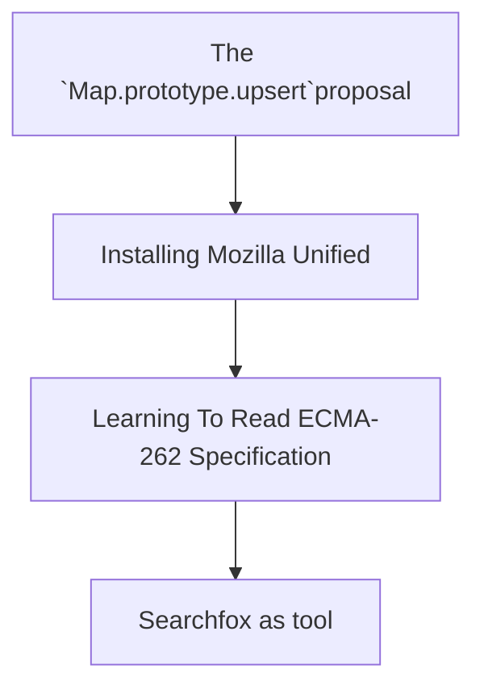

# Tutorial


Welcome to this detailed tutorial on how to implement and understand the `Map.prototype.upsert proposal`. This guide is tailored to help both beginners and advanced developers learn how to contribute to (JavaScript™) language development by implementing a new feature in SpiderMonkey, Mozilla's JavaScript™ engine. We’ll cover all the necessary steps, from downloading and setting up the development environment to writing the `upsert` function and testing it with the official test suite, Test262.

You don’t need prior knowledge of JavaScript™ engine internals or advanced C++ programming to follow along. We'll walk you through each part of the process step-by-step.

### What’s Covered in This Tutorial?

- __The `Map.prototype.upsert` Proposal:__ Learn what this proposal is, how it works, and why it’s beneficial for JavaScript™ developers.
- __Setting Up the Development Environment:__ How to download and build Mozilla Unified, the repository that contains SpiderMonkey.
- __Implementing the Proposal:__ We will implement the upsert function both in self-hosted JavaScript™ and C++.
- __Debugging and Testing:__ How to test your implementation using Test262, the official test suite for ECMAScript®, and how to run custom scripts.
- __Optimizing Your Code:__ Learn about performance considerations and optimizations.
- __Contributing to the ECMAScript® Standard:__ Understand how to write specification-compliant code and contribute to the broader ECMAScript® standard.


By the end of this tutorial, you will have a full implementation of `Map.prototype.upsert` and a solid understanding of how JavaScript™ engine features are developed.



**TODO testing is introduced in the end of the tutorial, but there are other ways to test implementation, writing scripts**

**TODO? explain the process of an ECMAScript® proposal, ex. phases 2 -> 2.7 etc**

<details open>
   <summary><h2>The `Map.prototype.upsert` proposal</h2></summary>

   **What is it?**

   Map.prototype.upsert is a new method for JavaScript™'s Map-object. The operation simplifies the process of inserting or updating key-value pairs in the Map. The function simply checks for existence of a key to either insert or update new key-value pairs.

   **How does it work?**
   The "upsert" operation takes two arguments: a key and a handler object. The handler contains two properties:

* update: Function to modify value of a key if the key is already existing in the Map.
* insert: Function that generates a default-value to be set to the belonging value of the checked key.

   **The function follow these steps:**

   1. The Map is checked for the key passed as argument. If the key is found:
       * It checks the handler for "update" function. If found this is used to update the value belonging to the key to then return it
   2. If it is not found, the insert function from the handler is used to generate a new value, assign this to the passed key and then return the new value.
   3. Either way, the belonging value will be returned.

   **What is the motivation?** Adding and updating values of a Map are tasks that developers often perform in conjunction. There are currently no Map prototype methods for either of those two things, let alone a method that does both. The workarounds involve multiple lookups and developer inconvenience while avoiding encouraging code that is surprising or is potentially error prone.

   <details>
   <summary>
   Either update or insert for a specific key
   </summary>

   Before:

   ```js
   // two lookups
   old = map.get(key);
   if (!old) {
     map.set(key, value);
   } else {
     map.set(key, updated);
   }
   ```

   Using upsert:

   ```js
   map.upsert(key, {
     update: () => updated,
     insert: () => value
   });
   ```

   </details>
   <details>
   <summary>
   Just insert if missing:
   </summary>

   Before:

   ```js
   // two lookups
   if (!map1.has(key)) {
     map1.set(key, value);
   }
   ```

   Using upsert:

   ```js
   map.upsert(key, {
     insert: () => value
   });
   ```

   </details>
   <details>
   <summary>
   Just update if present:
   </summary>

   Before:

   ```js
   // three lookups
   if (map.has(key)) {
     old = map.get(key);
     updated = old.doThing();
     map.set(key, updated);
   }
   ```

   Using upsert:

   ```js
   if (map.has(key)) {
     map.upsert(key, {
       update: (old) => old.doThing()
     });
   }
   ```

   </details>

</details>

<details open>
   <summary><h2>Installing mozilla unified</h2></summary>

   In this section you will learn how to download the Mozilla environment based on your operating system. It will also feature setting up SpiderMonkey for development and introduce main tools which are used during development.

### 1. Installation of SpiderMonkey and required tools

  We will start by installing SpiderMonkey and all required tools.

  Before you start installing, we advice you to open a terminal and navigate to the desired location of the `mozilla_unified` folder.

  The installation process depends on your operating system, therefore you can click on the link under that matches yours.

* [Build Mozilla Firefox on Linux](https://firefox-source-docs.mozilla.org/setup/linux_build.html)
* [Build Mozilla Firefox on Mac](https://firefox-source-docs.mozilla.org/setup/macos_build.html)
* [Build Mozilla Firefox on Windows](https://firefox-source-docs.mozilla.org/setup/windows_build.html)

  
  During the installation, you will be asked which version of Firefox you want to build as a standard. In this tutorial we will choose `5: SpiderMonkey JavaScript™ engine`, which will allow for faster builds during development.

  It doesn't matter if you choose to use `hg` or `git` to grab the source code.

### 2. Running SpiderMonkey

  After the installation is completed a folder named `mozilla-unified` should now appear in the folder your terminal was located when starting the guide above.

  Navigate into `mozilla-unified` folder using `cd mozilla_unified`.

  In order to run the SpiderMonkey engine, we first have to build it:

  ```sh
  ./mach build
  ```

  After executing this command the output should look something like this:

  ```sh
  Your build was successful!
  To take your build for a test drive, run: |mach run|
  ```
  
  In order to run the finished build, execute this command:

  ```sh
  ./mach run
  ```

  Your terminal should now enter the JavaScript™ Read-Eval-Print-Loop mode. 
  The functionality is similar to a browsers console and arbitrary JavaScript™ code can be executed. 

  ```sh
  js>
  ```

  This will be used to test our implementation throughout the tutorial.
  
  You can use it to write js-lines to evaluate. This will output `Hello World!` in the console:

  ```sh
  js> console.log("Hello World!");
  ```
  
  You can also execute `.js` files, which is done by giving the filename as a parameter in the `/mach run` command: 

  If you create a file called `helloworld.js` with `console.log("Hello World!);` in it and save it. You can execute it like this (given it is in the same folder):
  ```sh
  ./mach run helloworld.js
  ```

### 3. Applying simple changes

  Self-hosted code is located in `mozilla-unified/js/src/builtin`. Here we can edit or add/remove functions.

  To see the effect of this, we can change the return value of a function.

  Open file `Array.js` and change function `ArrayAt` to return 42.

  Test your changes by rebuilding and running the SpiderMonkey and then call the function with valid parameters.
  ```sh
    js> var l = [1,2,3];
    js> l.at(1);
    42
  ```

  Self-hosted code is a bit different to normal JavaScript™, given that you can effectively and easily edit/create functions you want.
  This can cause problems, more on this later.

</details>

<details open>
   <summary><h2>How to Read the ECMA-262 Language Specification</h2></summary>

### 1. What is the ECMA-262 Specification?

* ECMA-262 is the official document that defines how JavaScript™ works. It tells developers and browser makers what JavaScript™ should do in every situation.

### 2. How to Navigate the Document

* **Start with the Table of Contents**: This is where you’ll find major sections like grammar, types, and functions. It helps you jump to the part you’re interested in.
* **Use Search**: The specification is large. If you’re looking for a specific topic, like “Promise” or “Array,” use your browser’s search function (`Ctrl + F`/`cmd + F`) to find it quickly.
* **Annexes (Extras)**: At the end of the document, you’ll find extra sections that explain older features or give additional context.

### 3. How to Read the Algorithms

* **Algorithms are like instructions**: The spec breaks down how JavaScript™ works using step-by-step instructions, almost like a recipe.
* **Steps to follow**: For example, the spec describes how `Array.prototype.push` works with small, numbered steps: first, it checks the current length, then adds the new element, and finally updates the array’s length.
* **Conditions**: You’ll often see steps like “If X is true...” which means that JavaScript™ checks something, and the next steps depend on the result.

### 4. Key Symbols and What They Mean

* **`[[ ]]` (Double Brackets)**: These represent internal properties of JavaScript™ objects. These are properties that JavaScript™ uses internally but developers can’t directly access.
* **`?` (Question Mark)**: This shorthand means "if this operation results in an error (abrupt completion), return that error immediately." For example, `? Call(func, arg)` means that if calling `func` with `arg` throws an error, stop the current process and return the error right away.
* **`Return`**: This marks the end of an operation, and tells you the result.
* **Keywords**: Words like `if`, `else`, or `function` follow specific rules, which are detailed in the specification.

### 5. Finding Information on Other Symbols

* The specification also uses symbols like `< >` for describing syntactic elements and different notations for describing the structure of code. To understand these symbols:
  * Look at the section called **"Notation"** in the specification, which explains the meaning of each symbol in detail.
  * For example, `<T>` in Backus-Naur Form (BNF) means a non-terminal element, which is used to describe parts of the language structure.

### 6. Start Simple

* Don’t dive into the complex parts immediately. Start by reading sections like the **Introduction** or common JavaScript™ features such as arrays or functions.
* **External Help**: Use resources like [SearchFox.org](https://searchfox.org/) to browse and search for JavaScript™ engine implementations or additional explanations before checking the more technical spec.

### 7. Example: Understanding `Array.prototype.push`

* In the specification, you can search for `Array.prototype.push` to see how it works. The algorithm will explain:
  * First, the length of the array is checked.
  * Then, the new element is added to the array.
  * Finally, the length property is updated to reflect the added element.

   **TODO first task is getting a rough understanding of the upsert spec, write line by line understamding, provide example solution**


### Interpretation of the `Map.prototype.upsert` specification

The ESCMAScript262 specification text can look intitmidating at first glance. Before starting the implementation, you 
should try to get a rough understanding of what each line in the spec means. Write pseudo code, sentences or a combination. 
The goal is gain an overview of what we are trying to achieve.

**Rewrite the spec in your own words**
Example: 
3. Let __entries__ be the `List` that is __M__.[[MapData]].
-->>
3. make a `List` variable __entries__, which stores pairs `(key, value)`

In the implementation part of this tutorial, each line of the specification will be explained.

</details>

<details open>
   <summary><h2>Searchfox</h2></summary>

   When implementing a feature Searchfox is a powerful tool. Searchfox provides an indexed view of the source code, allowing developers to efficiently search for specific files, functions, or keywords. For instance, you can trace the implementation of existing JavaScript™ features, see how certain functions interact with SpiderMonkey’s internal data structures, or find how built-in JavaScript™ objects like Map are handled. SearchFox helps you navigate a seemingly endless and confusing codebase.

   When Implementing the `upsert` proposal, you will find that looking at existing implementations of similar functionality is often a good starting point. Combine the Ecma-262 Specification with Searchfox and look at existing code.

   Example workflow:

   1. --some line from the specification--
   2. Find some other function with the same spec line in the Ecma-262 specification
   3. Look up the function in Searchfox
   4. Borrow from the other function.

</details>

<details open>
   <summary><h2>Implementation</h2></summary>

### Creating a function

   Create a hook in `MapObject.cpp`:

    ```cpp

      JS_SELF_HOSTED_FN("upsert", "MapUpsert", 2,0),
    
    ```

    The JavaScript™ type `Map` is defined in CPP as `MapObject`. All Map methods, like Map::set and Map::get, are defined 
    in the array `MapObject::methods[]`. The line of code above links the CPP MapObject to our self hosted implementation.

    <details>
      <summary>A closer look at the hook</summary>
      - JS_SELF_HOSTED_FN: The function is implemented in self-hosted JavaScript™. Other possible implmenatations are FN, and INLINABLE_FN.
      - First argument: the name that JavaScript™ will use to call the function.
      - Second argument: the engine's function implementation.
      - Third argument: Number of arguments.
      - Fourth argument: Number of flags.
    </details>

    **Copy the Line above and paste it into `MapObject.cpp` under `MapObject::Methods`**

    Now in `Map.js` we can create a self-hosted JavaScript™ function. Write the follwoing into `Map.js`.

   ```js
   function MapUpsert(key, handler) {
     return 42
   }
   ```

   You should now have a function which returns the number 42. Build to test the implementation.

   ```sh
  ./mach build
  ...
  ./mach run
  ```

  ```sh
  js> const m = new Map()
  js> m.upsert(0,0)
  42
  ```


### Implement the first line

   ```
   1. Let M be the this value.
   ```

   ```js
   function MapUpsert(key, handler) {
     var M = this;
   }
   ```

### Moving on

   ```
   2. Perform ? RequireInternalSlot(M, [[MapData]]).
   ```

   The purpose of the operation `RequireInternalSlot(M, [[MapData]])` is to ensure that `M` is indeed a Map object. 
   In JavaScript™, objects may have internal slots, which are "hidden" properties that store information about the object. 
   In our case, the internal slot `[[MapData]]` holds the actual data of the Map. By verifying the presence of the internal slot, the method is making sure we actually are dealing with the correct object. This helps with preventing misusage of the function we are dealing with.  
   
   This step is common for most self-hosted MapObject methods. The solution for this step already exists in the code. Look at `MapForEach`.

   <details>
   <summary>Solution</summary>

   ```js
   function MapUpsert(key, handler) {
     var M = this;
   
     if (!IsObject(M) || (M = GuardToMapObject(M)) === null) {
       return callFunction(
         CallMapMethodIfWrapped,
         this,
         key,
         handler,
         "MapUpsert"
       );
     }
   }
   ```

   </details>

### Step 3 - engine space and user space

  **`callfunction` vs `callcontentfunction`?**

    In self-hosted JavaScript™ code, directly calling methods like `map.get()` is not allowed because user-defined (content) 
    scripts could modify built-in objects like Map. This practice is referred to as **monkey patching**, where external 
    scripts can modify or replace native methods. For example, if a script overwrites `Map.prototype.get()`, calling 
    `map.get()` could result in unexpected or even malicious behavior.

    To avoid this, SpiderMonkey provides two function-calling mechanisms in self-hosted code:

    **callFunction:** This allows calling non-altered (or safe) built-in functions directly. It's optimized for performance 
    because it assumes that the method hasn't been altered (i.e., it’s the native, built-in function).
    **callContentFunction:** This is the safer approach and should be used when there's a potential risk that the method or 
    object you're interacting with could have been altered by content scripts. It bypasses any modified versions of the 
    method and calls the native, built-in function safely.

    **When to Use Which?**
    __callFunction__ is faster but assumes that the function hasn’t been monkey-patched by external scripts. If the method 
    you're calling is guaranteed to be unaltered, you can use callFunction for better performance.

    __callContentFunction__ should be used if there’s any chance that the object or method has been altered by external 
    scripts. It's more reliable because it guarantees that the original, built-in function will be called, regardless of 
    any changes made by user scripts.

    **General Rule:**
    Use __callContentFunction__ when dealing with the this object or when there's any risk that built-in objects or methods 
    might have been altered by content (e.g., when interacting with objects like Map or Array).
    In the context of your tutorial, if you're interacting with the map (M), you should use callContentFunction to ensure 
    you're working with the original, unmodified method.

    **TODO: this rule is poorly explained/incorrect asessment**

   Read more [here](https://udn.realityripple.com/docs/Mozilla/Projects/SpiderMonkey/Internals/self-hosting)

   The purpose of self-hosted code is a combination of simplicity and efficiency (applies for some cases). But it comes with 
   strict limitations, as supposed to normal JavaScript™.

   **What methods can be used in self-hosted JavaScript™**
     - We can use other methods written in self-hosted code (remember, "everything" is an object)
     - We can use methods specified in selfHosting.cpp, which are made available to self-hosted code.

   ```cpp
   // Standard builtins used by self-hosting.
   // Code snippet from SelfHosting.cpp
       JS_FN("std_Map_entries", MapObject::entries, 0, 0),
       JS_FN("std_Map_get", MapObject::get, 1, 0),
       JS_FN("std_Map_set", MapObject::set, 2, 0),
   ```

   ```
   3. Let entries be the List that is M.[[MapData]].
   ```

   **Use std_Map_entries to get the list of entry records**

   <details>
   <summary>Solution</summary>

   ```js
   function MapUpsert(key, handler) {
     var M = this;
   
     if (!IsObject(M) || (M = GuardToMapObject(M)) === null) {
       return callFunction(
         CallMapMethodIfWrapped,
         this,
         key,
         handler,
         "MapUpsert"
       );
     }
   
     var entries = callFunction(std_Map_entries, M);
   }
   ```

   </details>

### Step 4 - iterating through the map entries

   ```
   4. For each Record { [[Key]], [[Value]] } e that is an element of entries, do
   ```

   **Different methods of iteration is used the other self-hosted Map methods**

   <details>
   <summary>Solution</summary>

   ```js
   function MapUpsert(key, handler) {
     var M = this;
   
     if (!IsObject(M) || (M = GuardToMapObject(M)) === null) {
       return callFunction(
         CallMapMethodIfWrapped,
         this,
         key,
         handler,
         "MapUpsert"
       );
     }
   
     var entries = callFunction(std_Map_entries, M);
   
     for (var e of allowContentIter(entries)) {
       var eKey = e[0];
       var eValue = e[1];
       //...
     }
   }
   ```

   </details>

   ```
   4a. If e.[[Key]] is not empty and SameValueZero(e.[[Key]], key) is true, then
   ```

    The purpose of iterating through the entries in the map is to check whether or not the key already exists in the map.
    This can be done by comparing the keys with SameValueZero.
   **Use the function SameValueZero to compare the key arg with the key from the iteration entry**

   <details>
   <summary>Solution</summary>

   ```js
   function MapUpsert(key, handler) {
     var M = this;
   
     if (!IsObject(M) || (M = GuardToMapObject(M)) === null) {
       return callFunction(
         CallMapMethodIfWrapped,
         this,
         key,
         handler,
         "MapUpsert"
       );
     }
   
     var entries = callFunction(std_Map_entries, M);
   
     for (var e of allowContentIter(entries)) {
       var eKey = e[0];
       var eValue = e[1];
       
       if (SameValueZero(key, eKey)) {
         //...
       }
     }
   }
   ```

   </details>

   ```
   4ai. If HasProperty(handler, "update") is true, then
   ```
   If the key was found in the map, we want to update the pair. The next step is to check if an update function was
   specified in the the handler.

   In JavaScript™ almost "everything" is an object. All values except primitives are objects. This means we can use 
   self-hosted Object methods in self-hosted Map method implementations.

   ```cpp
   // Code snippet from Object.cpp
   static const JSFunctionSpec object_methods[] = {
       //...
       JS_SELF_HOSTED_FN("toLocaleString", "Object_toLocaleString", 0, 0),
       JS_SELF_HOSTED_FN("valueOf", "Object_valueOf", 0, 0),
       JS_SELF_HOSTED_FN("hasOwnProperty", "Object_hasOwnProperty", 1, 0),
       //...
       JS_FS_END,
   };
   ```

   **Check if `handler` has the property `"update"`**

   <details>
   <summary>Solution</summary>

   ```js
   function MapUpsert(key, handler) {
     var M = this;
   
     if (!IsObject(M) || (M = GuardToMapObject(M)) === null) {
       return callFunction(
         CallMapMethodIfWrapped,
         this,
         key,
         handler,
         "MapUpsert"
       );
     }
   
     var entries = callFunction(std_Map_entries, M);
   
     for (var e of allowContentIter(entries)) {
       var eKey = e[0];
       var eValue = e[1];
       
       if (SameValueZero(key, eKey)) {
         if (callFunction(Object_hasOwnProperty, handler, 'update')) {
           //...
         }
       }
     }
   }
   ```

   </details>

   ```
   4ai1. Let updateFn be ? Get(handler, "update").
   ```

   **get the update handler if its specified**

   <details>
   <summary>Solution</summary>

   ```js
   function MapUpsert(key, handler) {
     var M = this;
   
     if (!IsObject(M) || (M = GuardToMapObject(M)) === null) {
       return callFunction(
         CallMapMethodIfWrapped,
         this,
         key,
         handler,
         "MapUpsert"
       );
     }
   
     var entries = callFunction(std_Map_entries, M);
   
     for (var e of allowContentIter(entries)) {
       var eKey = e[0];
       var eValue = e[1];
       
       if (SameValueZero(key, eKey)) {
         if (callFunction(Object_hasOwnProperty, handler, 'update')) {
           var updateFN = handler['update'];
           //...
         }
       }
     }
   }
   ```

   </details>

   ```
   4ai2. Let updated be ? Call(updateFn, handler, « e.[[Value]], key, M »).
   ```

   **Use `callFunction` to call updateFN, store it as `var updated`**

   <details>
   <summary>Solution</summary>

   ```js
   function MapUpsert(key, handler) {
     var M = this;
   
     if (!IsObject(M) || (M = GuardToMapObject(M)) === null) {
       return callFunction(
         CallMapMethodIfWrapped,
         this,
         key,
         handler,
         "MapUpsert"
       );
     }
   
     var entries = callFunction(std_Map_entries, M);
   
     for (var e of allowContentIter(entries)) {
       var eKey = e[0];
       var eValue = e[1];
       
       if (SameValueZero(key, eKey)) {
         if (callFunction(Object_hasOwnProperty, handler, 'update')) {
           var updateFN = handler['update'];
           var updated = callFunction(updateFN, M, Value, key);
           //...
         }
       }
     }
   }
   ```

   </details>

   ```
   4ai3. Set e.[[Value]] to updated.
   ```

   **Perform a `set` operation on the Map to update it (remember the standard built-in map operations).**

   ```cpp
   // Standard builtins used by self-hosting.
   // Code snippet from SelfHosting.cpp
       JS_FN("std_Map_entries", MapObject::entries, 0, 0),
       JS_FN("std_Map_get", MapObject::get, 1, 0),
       JS_FN("std_Map_set", MapObject::set, 2, 0),
   ```

   <details>
   <summary>Solution</summary>

   ```js
   function MapUpsert(key, handler) {
     var M = this;
   
     if (!IsObject(M) || (M = GuardToMapObject(M)) === null) {
       return callFunction(
         CallMapMethodIfWrapped,
         this,
         key,
         handler,
         "MapUpsert"
       );
     }
   
     var entries = callFunction(std_Map_entries, M);
   
     for (var e of allowContentIter(entries)) {
       var eKey = e[0];
       var eValue = e[1];
       
       if (SameValueZero(key, eKey)) {
         if (callFunction(Object_hasOwnProperty, handler, 'update')) {
           var updateFN = handler['update'];
           var updated = callFunction(updateFN, M, Value, key);
           callContentFunction(std_Map_set, M, key, updated);
         }
       }
     }
   }
   ```

   </details>

   ```
   4aii. Return e.[[Value]].
   ```

   Now that we have updated the map, the updated value should be returned.
   **return the var `updated`.**

   <details>
   <summary>Solution</summary>

   ```js
   function MapUpsert(key, handler) {
     var M = this;
   
     if (!IsObject(M) || (M = GuardToMapObject(M)) === null) {
       return callFunction(
         CallMapMethodIfWrapped,
         this,
         key,
         handler,
         "MapUpsert"
       );
     }
   
     var entries = callFunction(std_Map_entries, M);
   
     for (var e of allowContentIter(entries)) {
       var eKey = e[0];
       var eValue = e[1];
       
       if (SameValueZero(key, eKey)) {
         if (callFunction(Object_hasOwnProperty, handler, 'update')) {
           var updateFN = handler['update'];
           var updated = callFunction(updateFN, M, Value, key);
           callContentFunction(std_Map_set, M, key, updated);
         }
   
         return updated;
       }
     }
   }
   ```

   </details>

### Implementing the insert handler

   ```
   5. Let insertFn be ? Get(handler, "insert").
   6. Let inserted be ? Call(insertFn, handler, « e.[[Value]], key, M »).
   7. Set e.[[Value]] to inserted.
   8. Return e.[[Value]].
   ```

   **With the knowledge from implementing update, use similar techniques to implement insert.**

   <details>
   <summary>Solution</summary>

   ```js
   function MapUpsert(key, handler) {
     var M = this;
   
     if (!IsObject(M) || (M = GuardToMapObject(M)) === null) {
       return callFunction(
         CallMapMethodIfWrapped,
         this,
         key,
         handler,
         "MapUpsert"
       );
     }
   
     var entries = callFunction(std_Map_entries, M);
   
     for (var e of allowContentIter(entries)) {
       var eKey = e[0];
       var eValue = e[1];
       
       if (SameValueZero(key, eKey)) {
         if (callFunction(Object_hasOwnProperty, handler, 'update')) {
           var updateFN = handler['update'];
           var updated = callFunction(updateFN, M, Value, key);
           callContentFunction(std_Map_set, M, key, updated);
         }
   
         return updated;
       }
     }
   
     var insertFN = handler['insert'];
     var inserted = callFunction(insertFN, key, M);
     callContentFunction(std_Map_set, M, key, inserted);
   
     return inserted;
   }
   ```

   </details>

   ### Test the implementation

   Recall, you can create files and run them with the command:

    ```sh
    ./mach run MyFileName.js
    ```

  **Create a script to test your implementation or use the sample script below**


  <details>
    <summary>Script</summary>

   ```js
    console.log("Running tests for Map.prototype.upsert proposal...");

    // Utility function for logging test results
    function logResult(testName, actual, expected) {
        console.log(`Test: ${testName}`);
        console.log(`Expected: ${expected}`);
        console.log(`Actual: ${actual}`);
        console.log(actual === expected ? "Passed" : "Failed");
        console.log('------------------------------');
    }

    // Test 1: Update on existing key
    (function testUpdateExistingKey() {
        const map1 = new Map();
        map1.set("key1", "val1");

        map1.upsert("key1", {
            update: () => "updated"
        });

        logResult("Update on existing key", map1.get("key1"), "updated");
    })();

    // Test 2: Insert on existing key (should not change existing value)
    (function testInsertExistingKey() {
        const map1 = new Map();
        map1.set("key1", "val1");

        map1.upsert("key1", {
            insert: () => "inserted"
        });

        logResult("Insert on existing key (no change)", map1.get("key1"), "val1");
    })();

    // Test 3: Insert and update on existing key
    (function testInsertAndUpdateExistingKey() {
        const map1 = new Map();
        map1.set("key1", "val1");

        map1.upsert("key1", {
            update: () => "updated",
            insert: () => "inserted"
        });

        logResult("Insert and update on existing key", map1.get("key1"), "updated");
    })();

    // Test 4: Update nonexistent key (should not update, no effect)
    (function testUpdateNonexistentKey() {
        const map1 = new Map();

        try {
            map1.upsert("nonexistent", {
                update: () => "updated"
            });
        } catch (e) {
            console.log("Test: Update nonexistent key");
            console.log("Expected failure: cannot update nonexistent key");
            console.log('------------------------------');
        }

    })();

    // Test 5: Insert nonexistent key
    (function testInsertNonexistentKey() {
        const map1 = new Map();

        map1.upsert("nonexistent", {
            insert: () => "inserted"
        });

        logResult("Insert nonexistent key", map1.get("nonexistent"), "inserted");
    })();

    // Test 6: Insert and update nonexistent key (insert should happen)
    (function testInsertAndUpdateNonexistentKey() {
        const map1 = new Map();

        map1.upsert("nonexistent", {
            update: () => "updated",
            insert: () => "inserted"
        });

        logResult("Insert and update nonexistent key", map1.get("nonexistent"), "inserted");
    })();

    // Test 7: Increment counter twice
    (function testIncrementCounter() {
        const counter = new Map();

        counter.upsert("a", {
            update: (v) => v + 1,
            insert: () => 1
        });
        logResult("Increment counter first time", counter.get("a"), 1);

        counter.upsert("a", {
            update: (v) => v + 1,
            insert: () => 1
        });
        logResult("Increment counter second time", counter.get("a"), 2);
    })();
   ```
  </details>


</details>

<details open>
   <summary><h2>Issues with the original proposal</h2></summary>

The original proposal introduced a flexible solution by allowing both an `update` and an `insert` function, which added unnecessary complexity to the usage of `upsert`. Even though flexibility can be a good thing, it will in this case influence the cost of simplicity, which is very important for widespread adoption in programming languages.  

The process of checking if a key exists and then inserting it if not is most likely the primary use case of this method. By following the steps of the initial proposal, this process became unnecessarily complicated. Most developers typically just need to insert a value if the given key is missing, rather than having to provide sepreate logic for both `insert` and `update`. 

In additon, the approach of the original proposal don't align well with common practices in other known programming languages. An example which offers a similar and simpler functionality is seen in Python and is called `setdefault`. This method is written more about in the "Explaining the new proposal" section of the tutorial. 

By making it overcomplicated and a feature that is not commonly found in other languages, the method is at risk at being underutilized. Reducing the scope to a more straightforward function makes it more intuitive and more likely to be used effectively. 

</details>

<details open>
   <summary><h2>Explaining the new proposal</h2></summary>

   **What is the motivation for a new propsosal?**
   A common problem when using a Map is how to handle doing an update when you're not sure if the key already exists in the Map. This can be handled by first checking if the key is present, and then inserting or updating depending upon the result, but this is both inconvenient for the developer, and less than optimal, because it requires multiple lookups in the Map that could otherwise be handled in a single call.

   **What is the solution?**
   A method that will check whether the given key already exists in the Map. If the key already exists the value associated with the key is returned. Otherwise the key is inserted in to the map with the provided default value, then returning the newly inputted value.  

   **Simple use of "new" upsert:**

   ```js
    // Currently
    let prefs = new getUserPrefs();
    if (prefs.has("useDarkmode")) {
        let darkMode = prefs.get("useDarkmode");
    }
    else {
        prefs.set("useDarkmode", true);
        darkMode = true; //Default value
    }
    
    // Using upsert
    let prefs = new getUserPrefs();
        prefs.upsert("useDarkmode", true); // Default to true
   ```

By using upsert, default values can be applied at different times, with the assurance that later defaults will not overwrite an existing value. This is obviously because the key already exists and will return the existing key instead of inserting or overwriting.

<details>
<summary>
Similar functionality in Python
</summary>
As mentioned earlier in this tutorial, there are similar functionalities in other languages such as Python and it's "setdefault" method. In our case we use upsert on Map's. The setdefault method is used on dictionaries, lets use a similar code example:

```python
# Without setdefault
prefs = {}
if "useDarkmode" not in prefs : 
  prefs["useDarkmode"] = True # Default value

dark_mode = prefs["useDarkmode"]
```

```python
# Using setdefault
prefs = {}
prefs.setdefault("useDarkmode", True)
```

</details>

</details>

<details open>
    <summary><h2>Writing the new spec in ecmarkup</h2></summary>

  
  * **Installing Node.js and Node Package Manager**
      <details>
      <summary>
      <b>Windows</b>
      </summary>

      1. First go to Node.js official website (<https://nodejs.org/en>), and download the Windows Installer (recommended version).

      2. Run the installer and follow the instructions (make sure to check the box that says "Automatically install necessary tools").

      3. Verify installation by opening Command Prompt and typing:

      ```bash
      node -v
      npm -v
      ```
      This should return the versions of Node.js and npm.
      
      </details>

      <details>
      <summary><b>Mac</b></summary>
      
      1. Open Terminal
      2. Install Node.js via Homebrew by running the following command:
      ```bash
      brew install node
      ```
      3. Verify installation by typing:
      ```bash
      node -v
      npm -v
      ```
      </details>

      <details>
      <summary><b>Linux</b></summary>
      
      1. Open Terminal
      2. Update your package list:
 
      ```bash
      sudo apt update
      ```

       3. Install Node.js by running:
      ```bash
      sudo apt install node.js spm
      ```

      4. Verify the installation:
      ```bash
      node -v
      npm -v
      ```
      </details>


  * **Installing Ecmarkup**
    * Windows/Mac/Linux
      1. Open Command Prompt (Windows) or Terminal (Mac/Linux)
      2. Run the following command to install Ecmarkup globally:
      ```bash
      npm install -g ecmarkup
      ```
      3. Verify that Ecmarkup has been installed by typing:
      ```bash
      ecmarkup --version
      ```
      Now you have installed Ecmarkup.

* **How to write ecmarkup**
  Ecmarkup is a markup language used for writing technical spesifications. It has a syntax similar to `HTML`, making it intuitive for those familiar with web development. Here's a simple example of what an algorithm in a `.emu` file looks like (`.emu` is the file ending of an ecmarkup file):

  ```html
  <!DOCTYPE html>
  <meta charset="utf8">
  <link rel="stylesheet" href="https://cdnjs.cloudflare.com/ajax/libs/highlight.js/8.4/styles/github.min.css">
  <script src="./spec.js"></script>
  <pre class="metadata">
  title: Your Document Title
  stage: The proposals stage
  contributors: Your name
  </pre>

  <emu-clause id="sec-greater-than-five">
    <h1>greaterThanFive(_value_)</h1>
    <p>When the greaterThanFive method is called, the following steps are taken:</p>
    <emu-alg>
      1. Let _x_ be _value_.
      1. If Type(_x_) is not Number, throw a *TypeError* exception.
      1. If _x_ is NaN, throw a *RangeError* exception.
      1. If _x_ is less than 0, return *false*.
      1. If _x_ is greater than 5, return *true*.
      1. Else:
        1. Return *false*.
    </emu-alg>
  </emu-clause>
  ```

  **Note:** This is just an example of how an Ecmarkup file should be structured. The algorithm itself is illustrative and not a real-world example. 

* **How to translate from ECMAScript® to ecmarkup**
  
  Translating from ECMAScript® to Ecmarkup involves understanding the differences between what each reperesents. ECMAScript® is a scripting language specification, while Ecmarkup is a specialized markup language used to write and format **specification documents** for ECMAScript® and other web standards. 

    1. **Understanding why we need Ecmarkup**

        Ecmarkup combines HTML-like tags with specific syntactic constucts to write formal specifications. If you visit the tc39 official website, and locate ECMA-262, you can read ECMAScript® with hyperlinks to used terms, algorithms, and syntax definitions, allowing for easy navigation between different sections and components of the specification (<https://tc39.es/ecma262/>). This is made with Ecmarkup.
    2. **Basic translation steps**
        * `<emu-alg>`: Defines an algorithm.
        * `<emu-clause>`: Defines a clause/section in the specification.
        * Underscores are used to refer to variables (`_varname_`).
        * `<emu-xref>`: Link to other sections, clauses or algorithms within the specification. 
        * `*someBoldText*`: Make bold text with `*`.
        * Use double brackets (`[[...]]`) when documenting or referring to the internal, hidden mechanisms of objects that are not directly accessible in the JavaScript™ language but are crucial for the implementation and behavior of the object.

* The function `upsert(key, callbackfn)` in ecmarkup (can also be found under the spec-folder in this proposal)
    ```emu
      <!DOCTYPE html>
      <meta charset="utf8">
      <link rel="stylesheet" href="https://cdnjs.cloudflare.com/ajax/libs/highlight.js/8.4/styles/github.min.css">
      <script src="./spec.js"></script>
      <pre class="metadata">
      title: Map.prototype.upsert
      stage: 2
      contributors: Lauritz Angeltveit
      </pre>

      <emu-clause id="sec-map.prototype.upsert">
        <h1>Map.prototype.upsert ( _key_, _callbackfn_ )</h1>
        <p>When the upsert method is called the following steps are taken:</p>
        <emu-alg>
          1. Let _M_ be the *this* value.
          1. Perform ? RequireInternalSlot(_M_, [[MapData]]).
          1. If IsCallable(_callbackfn_) is false, throw a *TypeError* exception.
          1. For each Record { [[Key]], [[Value]] } _e_ that is an element of _M_.[[MapData]], do:
            1. If _e_.[[Key]] is not empty and SameValueZero(_e_.[[Key]], _key_) is *true*, return _e_.[[Value]].
          1. Let _inserted_ be ? Call(_callbackfn_, _key_).
          1. Set _e_.[[Value]] to _inserted_.
          1. Return _e_.[[Value]].
        </emu-alg>
      </emu-clause>
    ```

* **Building the spec**
  To build the spec, use the following command:

    ```bash
      ecmarkup spec.emu out.html
    ```

  In this command:
    * `spec.emu` is the source file where you have written your specification using Ecmarkup.
    * `out.html` is the output file, which is a runnable HTML document.
  To verify that your specification has been built correctly, simply drag-and-drop the `out.html` file into a web browser. 
  
  TODO: Troubleshooting while building the spec.
  TODO: Load the html file to verify successfully connected hyperlinks etc.

</details>

<details open>
  <summary><h2>Implementing the new proposal</h2></summary>

  ### Step 1-4 - the logic remains the same


  ```

  1. Let M be the this value.
  2. Perform ? RequireInternalSlot(M, [[MapData]]).
  3. Let entries be the List that is M.[[MapData]].
  4. For each Record { [[Key]], [[Value]] } e that is an element of entries, do

  ```

  These lines are similar to the previous proposal specification. The code remains unchanged.

  **Use the code from the old implementation and changes the `handler` parameter to `value`**

  <details>
    <summary>Solution</summary>

```js

function MapUpsert(key, value) {
  var M = this;

  if (!IsObject(M) || (M = GuardToMapObject(M)) === null) {
    return callFunction(
      CallMapMethodIfWrapped,
      this,
      key,
      value,
      "MapUpsert"
    );
  }

  var entries = callFunction(std_Map_entries, M);

  for (var e of allowContentIter(entries)) {
    var eKey = e[0];
    var eValue = e[1];

    //...
  }
}

```

  </details>

  ### Step 4a - If the key exists, return the value

  ```
  4a. If e.[[Key]] is not empty and SameValueZero(e.[[Key]], key) is true, return e.[[Value]].
  ```

  This is where the logic changes in the newer proposal. The new proposal does not care about updates.

  **If the key exists, return it's value with a standard built-in get operation**

  <details>
    <summary>Solution</summary>

```js

function MapUpsert(key, value) {
  var M = this;

  if (!IsObject(M) || (M = GuardToMapObject(M)) === null) {
    return callFunction(
      CallMapMethodIfWrapped,
      this,
      key,
      value,
      "MapUpsert"
    );
  }

  var entries = callFunction(std_Map_entries, M);

  for (var e of allowContentIter(entries)) {
    var eKey = e[0];
    var eValue = e[1];

    if (SameValueZero(eKey, key)) {
      return callContentFunction(std_Map_get, M, key);
    }
  }
}

```

  </details>

  ### Step 5 & 6 - insert the new key value pair
  
  ```
  5. Set e.[[Value]] to value.
  6. Return e.[[Value]].
  ```

  If the key was not present in the map, set the new key-value pair and then return the value.

  **use a standard built-in `set` operation, and return `value`**

  <details>
    <summary>Solution</summary>

```js

function MapUpsert(key, value) {
  var M = this;

  if (!IsObject(M) || (M = GuardToMapObject(M)) === null) {
    return callFunction(
      CallMapMethodIfWrapped,
      this,
      key,
      value,
      "MapUpsert"
    );
  }

  var entries = callFunction(std_Map_entries, M);

  for (var e of allowContentIter(entries)) {
    var eKey = e[0];
    var eValue = e[1];

    if (SameValueZero(eKey, key)) {
      return callContentFunction(std_Map_get, M, key);
    }
  }

  callContentFunction(std_Map_set, M, key, value);

  return value;
}

```

  </details>
  
</details>

<details open>
   <summary><h2>Optimization</h2></summary>
  
  A proposal goes through several stages before it becomes a part of the ECMAScript® language.
  Every new feature introduces complexity, which can affect the performance of the SpiderMonkey engine.
  Therefore optimization becomes crucial when designing and implementing these features.
  In our case there is especially one line which could use some optimization:

  ```
  4. For each Record { [[Key]], [[Value]] } e that is an element of entries, do
  ```
  
  As of right now it is implemented like this:
  ```js
  for (var e of allowContentIter(entries)) {
    var eKey = e[0];
    var eValue = e[1];
    //...
  }
  ```

  The worst case for this is that is loops through the entire `entries`.
  This is rather slow, considering a lookup in maps should be ~O(1), given an efficient HashTable implementation.
  Therefore, we decided to try to optimize this line.

  **Demonstration: Create a new file; Runtime.js with the code below and run it with `./mach run`**

  <details>
    <summary>Runtime script</summary>

  ```js
    const iterations = 1000; 

  // Function to measure runtime of a given block of code
  function measureRuntime(callback, description) {
      console.log("############################");
      console.log(description);
      const startTime = Date.now(); // Get the start time in milliseconds
      
      // Execute the code block (callback function)
      callback();
      
      const endTime = Date.now(); // Get the end time in milliseconds
      const runtime = endTime - startTime; // Calculate the runtime
      console.log(`Runtime: ${runtime} milliseconds \n`);
  }

  // test upsert for e record of entries
  function withUpsert() {
      const m = new Map();

      var k = 0;
      while (k < iterations) {
          m.upsert(k, "val");
          k++;
      }
  }

  //test without upsert
  function withoutUpsert() {
      const m = new Map();

      var k = 0;
      while (k < iterations) {
          if (m.has(k)) {
              m.get(k);
          } else {
              m.set(k, "val");
          }
          k++;
      }
  }

  console.log("Starting tests...");
  measureRuntime(withUpsert, "Test upsert for " + iterations + " iterations");
  measureRuntime(WithoutUpsert, "Test without upsert for " + iterations + " iterations");

  ```

  </details>


  One solution we had, was to check if the entry was in the map, by using `std_has`.
  The problem with this, is that the function is not currently exposed to self hosted JavaScript™ code. The reason for this
  is seemingly because there has not been any need for the `std_has` method in self-hosted code previously.

  `Selfhosting.cpp`
  ```cpp

    // Standard builtins used by self-hosting.
    //...
    JS_FN("std_Map_entries", MapObject::entries, 0, 0),
    JS_FN("std_Map_get", MapObject::get, 1, 0),
    JS_FN("std_Map_set", MapObject::set, 2, 0),
    //...

  ```

  We want to add this line so that we can use `has` in our optimized implementation.

  ```cpp  

    JS_INLINABLE_FN("std_Map_has", MapObject::has, 1, 0, MapHas),

  ```

  Copy the line and paste it into `js/src/vm/Selfhosting.cpp`, before MapObject::set (to ensure consistency across files).

  <details>
    <summary>Solution</summary>
  
    ```cpp

    // Standard builtins used by self-hosting.
    //...
    JS_FN("std_Map_entries", MapObject::entries, 0, 0),
    JS_FN("std_Map_get", MapObject::get, 1, 0),
    JS_INLINABLE_FN("std_Map_has", MapObject::has, 1, 0, MapHas),
    JS_FN("std_Map_set", MapObject::set, 2, 0),
    //...

  ```
  </details>

  We also need to make the has function publicly exposed in `MapObject.h` to use it in self-hosted code.

  In `MapObject.h`, move this line from private to public.

  ```cpp
  [[nodiscard]] static bool has(JSContext* cx, unsigned argc, Value* vp);
  ```

  (This could be tricky) Let's break down the structure of the file:

  ```cpp
    class MapObject : public NativeObject {
      public:
        //...
        const ValueMap* getData() { return getTableUnchecked(); }

        [[nodiscard]] static bool get(JSContext* cx, unsigned argc, Value* vp);
        [[nodiscard]] static bool set(JSContext* cx, unsigned argc, Value* vp);
        //add has here

        //...

      private: 
        //...
        [[nodiscard]] static bool size_impl(JSContext* cx, const CallArgs& args);
        [[nodiscard]] static bool size(JSContext* cx, unsigned argc, Value* vp);
        [[nodiscard]] static bool get_impl(JSContext* cx, const CallArgs& args);
        [[nodiscard]] static bool has_impl(JSContext* cx, const CallArgs& args);
        [[nodiscard]] static bool has(JSContext* cx, unsigned argc, Value* vp); //remove this line
        [[nodiscard]] static bool set_impl(JSContext* cx, const CallArgs& args);
        [[nodiscard]] static bool delete_impl(JSContext* cx, const CallArgs& args);
        [[nodiscard]] static bool delete_(JSContext* cx, unsigned argc, Value* vp);
        [[nodiscard]] static bool keys_impl(JSContext* cx, const CallArgs& args);
        //...
    }

  ```

  Now the `std_has`method should be available in self-hosted JavaScript™.
  **TODO provide a test function to verify that has was correctly exposed**

  ### Optimize the function

  With has now exposed to self-hosted code, alter your implementation to use `std_has` instead of a for-of iteration
  and `SameValueZero`.

  <details>
    <summary>Solution</summary>

    ```js
      function MapUpsert(key, value) {
        var M = this;

        if (!IsObject(M) || (M = GuardToMapObject(M)) === null) {
            return callFunction(      
                CallMapMethodIfWrapped, 
                this,
                key,
                value,             
                "MapUpsert"
            );
        }

        if (callContentFunction(std_Map_has, M, key)) {
          return callFunction(std_Map_get, M, key);
        }

        callContentFunction(std_Map_set, M, key, value);
          return value;
      }
    ```
  </details>


  **TODO explain further on std_has**

  **TODO? more advanced, next iteration introducing cpp code**

  
  </details>
</details>

<details open>

   <summary><h2>Testing (test262)</h2></summary>
   
   ### Writing tests for test262
   When it comes to testing implementations, there are some guidelines to follow. 
   The official guidelines state that an acceptable test in Test262 is the following:
   ```
   Any test that exercises observable grammar or semantics, originating with citable, 
   ormative text in the latest draft of the ECMAScript® Language Specification, 
   the ECMAScript® Internationalization API Specification, the The JSON Data Interchange Syntax, 
   a Stage 3 proposal or a Pull Request which makes a normative change to any of those specifications.
   ```

   The key point for this, is that we can write tests for any observable grammar or semantic from our specification.

   First we need to identify the so-called testable lines in our specification.
   One way to think about it, is when the behaviour of the specification is observable to the user, it is testable.
   
   An example of easily testable line in our specification is:
   ```2. Perform ? RequireInternalSlot(M, [[MapData]])```

   Recall that this line, among other things, checks if `this` is an Object, therefore we can test it by trying it on non-objects.
   Primitive types in JavaScript™ are not considered objects.
   So an example of the tests you can write for this, could look like this:
   
   ```js
   var m = new Map();
    
   assert.throws(TypeError, function () {
       m.upsert.call(false, 1);
   });
   ```

   The `assert` is part of the Test262 suite, here we assert that a TypeError is thrown.

   You can find the rest of the functions for assert [here](https://github.com/tc39/test262/blob/main/CONTRIBUTING.md#test-environment).

   ### More than just testing

   Additional to the tests, there is a strict guide for documentation for the test.
    
   You should start the test by declaring the copyright, here you just fill in the year and your name:
   ```
   // Copyright (C) *Year *Name. All rights reserved.
   // This code is governed by the BSD license found in the LICENSE file.
   ```

   The rest of the information is enclosed in a YAML string and has specified values to simplify parsing.
   All the info is inside the YAML tags `/*---` and `---*/`.

   We start with the required key `esid`, which is the ECMAScript® identifier. 
   This doesn't apply to us yet, as the proposal hasn't gotten one, therefore we will use `pending`.

   ```
   esid: pending
   ```

   Next comes the description which is the other required key. 
   The description should be short and on one line regarding the purpose of this testcase.
   In our case, it will look something like: 
   ```
   description: >
        Throws a TypeError if 'this' is not an object
   ```

   Although not required, we should fill out the `info` key aswell.
   Some points that are beneficial here are:
    - What does the method look like?
    - Which line of code are we testing?

   ```
   info: |
        Map.upsert( key , value )
        
        1. Let M be the this value
        2. Perform ? RequireInternalSlot(M, [[MapData]])
        ... 
   ```

   There are many other keys we can look at, but if you want to learn more about them, check out this [link](https://github.com/tc39/test262/blob/main/CONTRIBUTING.md#frontmatter).

   Our full test should now look something like this:
   ```js
   // Copyright (C) 2024 Sune Eriksson Lianes. All rights reserved.
   // This code is governed by the BSD license found in the LICENSE file.
   /*---
   esid: pending
   description: >
       Throws a TypeError if `this` is not an Object.
   info: |
       Map.upsert ( key, value )

       1. Let M be the this value
       2. Perform ? RequireInternalSlot(M, [[MapData]])
       ...
   ---*/
   var m = new Map();

   assert.throws(TypeError, function () {
       m.upsert.call(false, 1, 1);
   });
   ```
   ### Fill in test cases
   We can now fill in with other test cases (non-objects):
   ```js
   // Copyright (C) 2024 Sune Eriksson Lianes. All rights reserved.
   // This code is governed by the BSD license found in the LICENSE file.
   /*---
   esid: pending
   description: >
       Throws a TypeError if `this` is not an Object.
   info: |
       Map.upsert ( key, value )

       1. Let M be the this value
       2. Perform ? RequireInternalSlot(M, [[MapData]])
       ...
   features: [Symbol]
   ---*/
   var m = new Map();

   assert.throws(TypeError, function () {
       m.upsert.call(false, 1, 1);
   });

   assert.throws(TypeError, function () {
       m.upsert.call(1, 1, 1);
   });
    
   assert.throws(TypeError, function () {
       m.upsert.call("", 1, 1);
   });
    
   assert.throws(TypeError, function () {
       m.upsert.call(undefined, 1, 1);
   });
    
   assert.throws(TypeError, function () {
       m.upsert.call(null, 1, 1);
   });
    
   assert.throws(TypeError, function () {
       m.upsert.call(Symbol(), 1, 1);
   });
   ```

   You can take a look at other tests written in the test262 folder or try to write some tests yourself.
   
   ### Running tests in SpiderMonkey
   To add the test you simply create the file in `mozilla-unified/js/src/tests/test262/built-ins/Map/`. 
   Preferably creating a folder for the proposal as well.

   When this is done, you can run the tests with `./mach jstests built-ins/Map`, or be even more specific if you have created a folder.
   
   You will then see something like this, depending on how many tests are run:
   ```sh
   [1|0|0|0]  12% =====>                                                
   [2|0|0|0]  25% ============>                                         
   [3|0|0|0]  37% ===================>                                  
   [4|0|0|0]  50% ==========================>                           
   [5|0|0|0]  62% =================================>                    
   [6|0|0|0]  75% ========================================>             
   [7|0|0|0]  87% ===============================================>      
   [8|0|0|0] 100% ======================================================
   [8|0|0|0] 100% ======================================================>|   
   0.4s
   ```

   A general tip for testing is looking at how similar lines are tested in other implementations.
</details>


