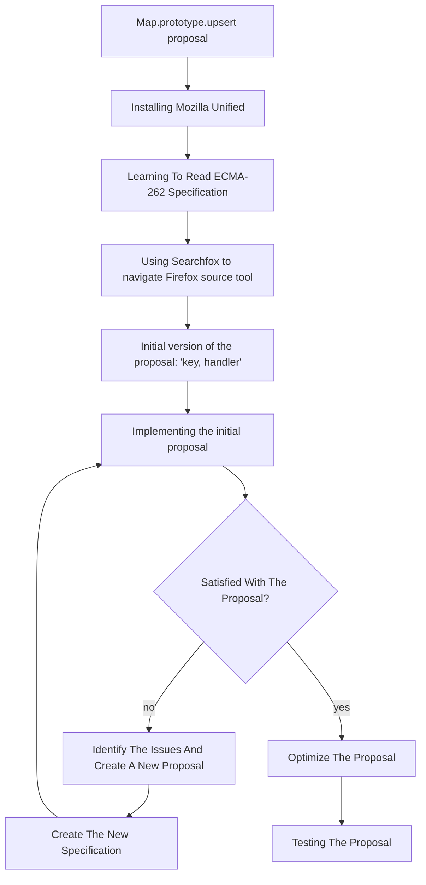

# Tutorial

### ECMAScript®

JavaScript™ is standardized by ECMAScript® and specified in the <a href="https://ecma-international.org/publications-and-standards/standards/ecma-262/" target="_blank">ECMA-262 language specification</a>, which is maintained by Ecma International's <a href="https://tc39.es/" target="_blank">TC39 committee</a>. ECMAScript® defines the core features of the language, providing a standard that ensures consistency across different JavaScript™ engines. Major engines like <a href="https://v8.dev/" target="_blank">V8</a> (used in Chrome and Node.js), <a href="https://developer.apple.com/documentation/javascriptcore" target="_blank">JavaScriptCore</a> (Safari), and <a href="https://spidermonkey.dev/" target="_blank">SpiderMonkey</a> (Firefox) implement these specifications, allowing developers to write code that behaves similarly across different environments.

<a href="https://spidermonkey.dev/">SpiderMonkey</a>, the engine developed by Mozilla, powers JavaScript™ execution in <a href="https://www.mozilla.org/en-US/firefox/">Firefox</a> and supports development of new language features. This tutorial focuses on working within SpiderMonkey to implement and test an ECMAScript® proposal, providing insight into both the ECMAScript® standardization process and the inner workings of a JavaScript™ browser engine.

### Introduction

Welcome to this detailed tutorial on how to implement and understand the <a href="https://github.com/tc39/proposal-upsert" target="_blank">`Map.prototype.upsert`</a> proposal. This tutorial is tailored to help both beginners and advanced developers learn how to contribute to JavaScript™ language development by implementing a new feature in SpiderMonkey - Mozilla's JavaScript™ engine. We will cover all the necessary steps, from downloading and setting up the development environment to specifying and implementing the `upsert` method and testing it with the official test suite, <a href="https://github.com/tc39/test262" target="_blank">Test262</a>.

We'll start with an introduction to the `Map.prototype.upsert` proposal, highlighting its benefits for developers. From there, you'll be guided through setting up the development environment using the SpiderMonkey engine. You'll then implement the `upsert` method using both <a href="https://udn.realityripple.com/docs/Mozilla/Projects/SpiderMonkey/Internals/self-hosting">*self-hosted*</a> JavaScript™ and (a little bit of) C++, ensuring alignment with the ECMAScript® specification. 

The main focus will initially be on developing a functional solution. Once basic functionality is working, optimization techniques will be applied to ensure your code is efficient and performant. You'll also gain insight into contributing to the ECMAScript® standard, aligning your code with the best practises in the JavaScript™ evolution. Finally, you'll explore testing with <a href="https://github.com/tc39/test262">Test262</a>, the official ECMAScript® test suite, learning how to write custom tests to validate your implementation.

By the end of this tutorial, you'll have implemented a fully functional `upsert` method and gained an understanding into the process of designing, testing and standardizing JavaScript™ features.

### Authors

This tutorial has been written and edited by: **Lauritz Thoresen Angeltveit**, **Jonas Haukenes**, **Vetle Larsen**, **Sune Lianes**, **Mathias Hop Ness**, and **Mikhail Barash**, and is a result of a project conducted at the University of Bergen (Norway) in collaboration with **Daniel Minor** (Mozilla) during August - November 2024.

Project supervisors: **Daniel Minor** (Mozilla), **Mikhail Barash** (University of Bergen, Norway).
Project facilitators: **Yulia Startsev** (Mozilla), **Mikhail Barash** (University of Bergen, Norway).

This tutorial can be cited as:
```
L. Angeltveit, J. Haukenes, V. Larsen, S. Lianes, M. Ness, M. Barash. Implementing a JavaScript API proposal `Map.prototype.upsert` (a tutorial). 2024. 
```


### What Is Covered in This Tutorial?

- __The `Map.prototype.upsert` Proposal:__ Learn what <a href="https://github.com/tc39/proposal-upsert">this proposal</a> is, how it works, and why it’s beneficial for JavaScript™ developers.
- __Setting up the development environment:__ How to download and build <a href="https://hg.mozilla.org/mozilla-unified/">_Mozilla Unified_</a>, the repository that contains SpiderMonkey.
- __Implementing the proposal:__ We will implement the `upsert` method both in <a href="https://udn.realityripple.com/docs/Mozilla/Projects/SpiderMonkey/Internals/self-hosting">self-hosted</a> JavaScript™ and C++.
- __Debugging and testing:__ How to test your implementation using <a href="https://github.com/tc39/test262">Test262</a>, the official test suite for ECMAScript®, and how to run custom scripts.
- __Optimizing the code:__ Learn about performance considerations and optimizations.
- __Contributing to the ECMAScript® Specification:__ Understand how to write <a href="https://tc39.es/proposal-upsert/">specification</a>-compliant code and contribute to the broader <a href="https://262.ecma-international.org/">ECMAScript® standard</a>.



<details open>
   <summary><h2>The `Map.prototype.upsert` proposal</h2></summary>

   **What is it?**

   `Map.prototype.upsert` is a new method for `Map`-object in JavaScript™. The operation simplifies the process of inserting or updating key-value pairs in the `Map`: it checks for existence of a key and then either `insert`s or `update`s a key-value pair.

   **How does it work?**
   The `upsert` operation takes two arguments: a `key` and a `handler` object. The `handler` contains two properties:

* `update`: A function to modify `value` of a `key` if it is already present in the `Map`.
* `insert`: A function that generates a `default-value` to be set to the belonging `value` of the checked `key`.

   **The function `upsert` operates following these steps:**

   1. The `Map` is checked for the `key` passed as argument. If found:
       * It checks the `handler` for an `update` function. If found, this is used to `update` the `value` belonging to the passed `key`. After this, the newly updated entry will be returned. 
   2. If not found, the `insert` function from the `handler` is used to generate a new `value`. This will be assigned to the given `key` before returning it.
   3. In either case, the `value` will be the return value of the `upsert` method.

   **What is the motivation?** Adding and updating values of a `Map` are oftentimes performed in conjunction. Currently, there are no `Map` methods for either of these two actions - let alone a method that would do both. Usual workarounds involve multiple lookups and can be inconvenient for developers, and lead to confusing and error-prone code. Introducing a new method `upsert` shall resolve these drawbacks.

#### Examples
   <details>
   <summary>
   Example: <i>Either updating or inserting for a specific key</i>
   </summary>

   - Without using the `upsert` function:

   ```js
   // two lookups
   old = map.get(key);
   if (!old) {
     map.set(key, value);
   } else {
     map.set(key, updated);
   }
   ```

   - Using the `upsert` function:

   ```js
   map.upsert(key, {
     update: () => updated,
     insert: () => value
   });
   ```

   </details>
   <details>
   <summary>
   Example: <i>Inserting if missing</i>
   </summary>

   - Without using the `upsert` function:

   ```js
   // two lookups
   if (!map1.has(key)) {
     map1.set(key, value);
   }
   ```

   - Using the `upsert` function:

   ```js
   map.upsert(key, {
     insert: () => value
   });
   ```

   </details>
   <details>
   <summary>
   Example: <i>Updating if present</i>
   </summary>

   - Without using the `upsert` function:

   ```js
   // three lookups
   if (map.has(key)) {
     old = map.get(key);
     updated = old.doThing();
     map.set(key, updated);
   }
   ```

   - Using the `upsert` function:

   ```js
    map.upsert(key, {
      update: (old) => old.doThing()
    });
   ```

   </details>

</details>

<details open>
   <summary><h2>Installing Mozilla Unified</h2></summary>

   In this section you will learn how to download the Mozilla environment for your operating system. It will also feature setting up SpiderMonkey for development and introduce main tools which are used during development.

### 1. Installation of SpiderMonkey and required tools

  We will start by installing SpiderMonkey and all the required tools.

  Before you start installing, open a terminal and navigate to the desired location of the `mozilla_unified` folder.

  The installation process depends on your operating system - please use the link below that matches yours.

* <a href="https://firefox-source-docs.mozilla.org/setup/linux_build.html" target="_blank">Build Mozilla Firefox on Linux</a>
* <a href="https://firefox-source-docs.mozilla.org/setup/macos_build.html" target="_blank">Build Mozilla Firefox on Mac</a>
* <a href="https://firefox-source-docs.mozilla.org/setup/windows_build.html" target="_blank">Build Mozilla Firefox on Windows</a>

  
During the installation, you will be asked which version of Firefox you want to build as a standard. In this tutorial we will choose `5: SpiderMonkey JavaScript™ engine`, which will allow for faster builds during development.

It doesn't matter if you choose to use <a href="https://en.wikipedia.org/wiki/Mercurial">`hg`</a> or <a href="https://en.wikipedia.org/wiki/Git">`git`</a> to grab the source code.

**Troubleshooting**

<a href="https://firefox-source-docs.mozilla.org/setup/common_build_errors.html" target="_blank">Here</a> are some of the most common build errors. __Note!__ Many errors can be related to your Python build. Ensure you are using the correct Python path and/or configuration.

### 2. Running SpiderMonkey

After the installation is complete, a folder named `mozilla-unified` should appear in the folder where the terminal was located when you started step 1.

  Navigate into `mozilla-unified` folder using `cd mozilla_unified`.

  In order to run the SpiderMonkey engine, we first have to build it:

  ```sh
  ./mach build
  ```

  After executing this command, the output should look something like this:

  ```sh
  Your build was successful!
  To take your build for a test drive, run: |mach run|
  ```
  
  In order to run the finished build, execute this command:

  ```sh
  ./mach run
  ```

  Your terminal should now enter the JavaScript™ <a href="https://en.wikipedia.org/wiki/Read%E2%80%93eval%E2%80%93print_loop">Read-Eval-Print-Loop</a> mode. 
  The functionality is similar to a browser console. You can execute arbitrary JavaScript™ code. 

  ```sh
  js>
  ```

  This will be used to test our implementation throughout the tutorial.
  
  You can use it to write js-lines to evaluate. This will output `Hello World!` in the console:

  ```sh
  js> console.log("Hello World!");
  ```
  
  You can also execute `.js` files - this is done by passing the filename as a parameter in the `./mach run` command: 
  ```sh
  ./mach run helloworld.js
  ```
  
### 3. Applying simple changes

  Self-hosted code is located in <a href="https://hg.mozilla.org/mozilla-unified/file/tip/js/src/builtin">`mozilla-unified/js/src/builtin`</a>.
  
  In the local copy, we can edit, add or remove functions. As an example, we demonstrate how we can change the return value of a function. Open file <a href="https://hg.mozilla.org/mozilla-unified/file/tip/js/src/builtin/Array.js">`Array.js`</a> and change function <a href="https://hg.mozilla.org/mozilla-unified/file/tip/js/src/builtin/Array.js#l1168">`ArrayAt`</a> to always <a href="https://hg.mozilla.org/mozilla-unified/file/tip/js/src/builtin/Array.js#l1192">return</a> the value `42`. We can now test this change by rebuilding and running the SpiderMonkey and then calling the function with some valid parameters, as shown below:
  ```sh
    ./mach build
    ./mach run
    js> var myArray = [1, 2, 3];
    js> myArray.at(1);
    42
  ```

  Self-hosted code is a somewhat different from ordinary JavaScript™, given that you can effectively and easily edit/create functions you want.
  This can cause problems in certain situations - we will discuss more on this later.

</details>

<details open>
   <summary><h2>How to Read the ECMA-262 Language Specification</h2></summary>

### 1. What is the ECMA-262 Specification?

* <a href="https://262.ecma-international.org/" target="_blank">ECMA-262</a> is the official document that defines the programming language ECMAScript® (also known as JavaScript™). It provides detailed guidelines for developers and browser vendors on how JavaScript™ should behave in every situation, ensuring consistency and compatibility across different platforms and implementations.

### 2. How to Navigate the Document

* **Start with the _Table of Contents_**: This is where you’ll find major sections describing the language's grammar and constructs, data types, standard library functions, and so on. It helps you jump to the part you’re interested in.
* **Use _Search_**: The specification is a large document. If you’re looking for a specific topic, like `Promise` or `Array`, use your browser’s search function (`Ctrl + F`/`cmd + F`) to find it quickly.
* **Annexes (Extras)**: At the end of the document, you’ll find extra sections that explain older features or give additional context.

### 3. How to Read the Algorithms

* **Algorithms are like instructions**: The specification breaks down how JavaScript™ works using [step-by-step instructions](https://262.ecma-international.org/#sec-algorithm-conventions), almost like a recipe.
* **Steps to follow**: The specification breaks down methods like <a href="https://262.ecma-international.org/15.0/index.html#sec-array.prototype.push" target="_blank">`Array.prototype.push`</a> into clear, numbered steps. For instance, it describes how the method first checks the current `length`, then adds the new element, and finally updates the array's `length`.
* **Conditionals and other control flow constructs**: You’ll often see `if`-statements, that will tell you how to proceed if the statement evaluates to `true` or `false`.

### 4. Some Key Symbols and What They Mean

* **`[[ ]]` (Double Square Brackets)**: These represent [internal properties of JavaScript™ objects](https://262.ecma-international.org/#sec-object-internal-methods-and-internal-slots). These are properties that JavaScript™ uses internally but developers can’t directly access.
* **`?` (Question Mark)**: This [shorthand](https://262.ecma-international.org/#sec-returnifabrupt-shorthands) means "if this operation results in an error (abrupt completion), `return` that error immediately." For example, `? Call(func, arg)` means that if calling `func` with `arg` throws an error, stop the current process and `return` the error right away.
* **`Return`**: This marks the end of an operation, specifying the result to be returned.
* **`{ }` (Curly braces)**: These are used to define a [**Record**](https://262.ecma-international.org/#sec-list-and-record-specification-type) structure. A **Record** is a data structure that groups together related fields as `key-value` pairs. Each field is identified by a name (`key`) and stores a specific `value`. These **Record** structures are specification-level entities.
* **Keywords in Algorithm Specifications**: Keywords like `If`, `Else`, or `Else if` are represented as **algorithmic steps** in plain text, rather than in code syntax, to describe the behavior that an implementation should follow.

### 5. Finding Information on Other Symbols

The specification text uses a range of notations and symbols to describe its syntax and structure. To understand these symbols, you can look into section <a href="https://262.ecma-international.org/15.0/index.html#sec-notational-conventions" target="_blank">Notational Conventions</a>. This section explains different types of symbols, and how they are used to define the language. 

For example, in section <a href="https://262.ecma-international.org/15.0/index.html#sec-nonterminal-symbols-and-productions" target="_blank">Nonterminal Symbols and Productions</a>, you can read about nonterminal symbols, which are shown in _italic font_, and learn how to read syntactic definition of a **`WhileStatement`** or an **`ArgumentList`**. 

### 6. Start Simple

* Avoid diving into the complex parts right away.
* Proceed with sections that describe common JavaScript™ features, such as [arrays](https://262.ecma-international.org/15.0/index.html#sec-array-objects) and [function objects](https://262.ecma-international.org/15.0/index.html#sec-function-objects).
* **External Help**: Use resources like <a href="https://searchfox.org/" target="_blank">SearchFox.org</a> to browse and search for JavaScript™ engine implementations or additional explanations before checking the more technical spec.
* You can also check out [_"How to Read the ECMAScript Specification"_](https://timothygu.me/es-howto/) or [_"Understanding ECMAScript"_](https://v8.dev/blog/tags/understanding-ecmascript): these are helpful guides on how to read the ECMA-262 Language Specification. 

### 7. Example: Understanding <a href="https://262.ecma-international.org/15.0/index.html#sec-array.prototype.push" target="_blank">`Array.prototype.push`</a>

In the specification, you can search for `Array.prototype.push` to see how it works. The algorithm will explain that:
  * first, the `length` of the array is checked
  * then, the new element is added to the array
  * finally, the `length` property is updated to reflect the added element.

## The `Map.prototype.upsert` Specification

This is the specification of the `Map.prototype.upsert` which will be implemented in this tutorial. This specification will guide our implementation, detailing each operation the `upsert` method needs to perform to insert or update a `key-value` pair in a `Map` object.

```lua
1. Let M be the this value.
  2. Perform ? RequireInternalSlot(M, [[MapData]]).
  3. Let entries be the List that is M.[[MapData]].
  4. For each Record { [[Key]], [[Value]] } e that is an element of entries, do
    4a. If e.[[Key]] is not empty and SameValueZero(e.[[Key]], key) is true, return e.[[Value]].
      4ai. If HasProperty(handler, "update") is `true`, then
        4ai1. Let updateFn be ? Get(handler, "update").
        4ai2. Let updated be ? Call(updateFn, handler, « e.[[Value]], key, M »).
        4ai3. Set e.[[Value]] to updated.
      4aii. Return e.[[Value]].
  5. Let insertFn be ? Get(handler, "insert").
  6. Let inserted be ? Call(insertFn, handler, « e.[[Value]], key, M »).
  7. Set e.[[Value]] to inserted.
  8. Return e.[[Value]].
```

An HTML version of the specification can be found <a href="https://bldl.github.io/upsert-tutorial/initial-emplace-spec/Map.prototype.emplace.html" target="_blank">here</a>.

The ECMA-262 Specification text can look intimidating at first glance. Before starting the implementation, try to get a rough understanding of what each line in the specification means. Write pseudocode, natural language sentences or a combination of them, for yourself to understand what is actually going on. 
The aim is to develop a clear understanding of the functionality we want to achieve.

**Key Points to Focus On:**

- __Scope and Validation:__ The first few lines establish the `this value` (`M`) and ensure it’s a valid instance of `Map`.
- __Iterating Over Entries:__ The method iterates through the `Map` entries to check if the specified `key` already exists.
- __Conditional Update or Insert:__ If the key exists, it checks for an `update` function in the `handler` and applies it to update the `value`. If the key does not exist, it uses the `insert` function to create a new entry.
- __Returning the Result:__ Finally, it returns the updated or inserted `value`.

By breaking down the specification in this way, you'll have a roadmap for implementing each part of the `upsert` method. This approach will help make the implementation process smoother and ensure that you understand how each step contributes to the overall functionality.

**Rewrite the Specification in Your Own Words**

Example: 

3. Let __entries__ be the `List` that is __M__.[[MapData]].

Could be rewritten to:

3. Make a `List` variable __entries__, which stores pairs `(key, value)`.

In the implementation part of this tutorial, each line of the specification will be explained.

</details>

<details open>
   <summary><h2>Searchfox</h2></summary>

  <a href="https://searchfox.org/" target="_blank">Searchfox</a> is a helpful tool. Searchfox provides an indexed view of the source code, allowing one to efficiently search for specific files, functions, or keywords. For instance, you can trace the implementation of existing JavaScript™ features, see how certain functions interact with SpiderMonkey’s internal data structures, or find how built-in JavaScript™ objects like `Map` are handled. SearchFox helps you navigate a seemingly endless and confusing codebase.

When implementing the `upsert` proposal, you will find that looking at existing implementations of similar functionality is often a good starting point. Combine the ECMA-262 Specification with Searchfox and look at existing code.

  Example of workflow when trying to implement a line of the specification:

  1. *Some line from the specification*.
  2. Find some other function with the same or similar specificatin line in the ECMA-262 Specification.
  3. Look up that other function in Searchfox.
  4. Borrow code from that other function's implementation.

</details>

<details open>
   <summary><h2>Implementation</h2></summary>

In this section, we’ll walk through the process of implementing the `Map.prototype.upsert` method step-by-step. We will examine each line of the specification in detail and you will gain a deep understanding of the implementation process. By the end, you’ll have a fully functional `upsert` method in JavaScript™, along with insight in where to find resources and information which gives you a strong foundation to implement additional functions on your own in the future.

### Creating a function

  The first step to implementing a function in SpiderMonkey is to create a *hook* in C++. This hook serves as the connection between SpiderMonkey’s C++ _core_ and our _self-hosted_ JavaScript™ code.

  The JavaScript™ type `Map` is defined in C++ as `MapObject` in the file [`MapObject.cpp`](https://hg.mozilla.org/mozilla-unified/file/tip/js/src/builtin/MapObject.cpp).
  All `Map` methods, such as `Map::set` and `Map::clear`, are defined 
  in the array [`MapObject::methods[]`](https://hg.mozilla.org/mozilla-unified/file/tip/js/src/builtin/MapObject.cpp#l510):

  ```cpp
// This code is from: /js/src/builtin/MapObject.cpp
// ...
const JSFunctionSpec MapObject::methods[] = {
    // ...
    JS_FN("set", set, 2, 0),
    JS_FN("delete", delete_, 1, 0),
    JS_FN("keys", keys, 0, 0),
    JS_FN("values", values, 0, 0),
    JS_FN("clear", clear, 0, 0),
    JS_SELF_HOSTED_FN("forEach", "MapForEach", 2, 0),
    JS_FN("entries", entries, 0, 0),
    // ...
};
```
  
  To add method `upsert`, we need to define a hook in this array:
  
  ```cpp
    // ...
    JS_SELF_HOSTED_FN("upsert", "MapUpsert", 2,0),
    // ...
  
  ```

  Here, we invoke [`JS_SELF_HOSTED_FN`](https://searchfox.org/mozilla-central/rev/2fc2ccf960c2f7c419262ac7215715c5235948db/js/public/PropertySpec.h#438), which sets up the hook: it indicates that the function whose name is mentioned in the first argument of `JS_SELF_HOSTED_FN` is implemented in _self-hosted_ JavaScript™ - meaning the main logic of the function's behaviour is written in JavaScript™ rather than C++.
  We pass the following actual arguments to `JS_SELF_HOSTED_FN`:
  
  |argument|in our case|explanation|
  |--------|-----------|-----------|
  |_first argument_|`"upsert"`|indicates the function name as it will appear in JavaScript™ standard library|
  |_second argument_|`"MapUpsert"`|indicates the name of the JavaScript™ implementation (which we’ll define shortly) for the function|
  |_third argument_|`2`|indicates the number of arguments that the function mentioned in the _first argument_ will have|
  |_fourth argument_|`0`|specifies flags (we omit this in the tutorial)|
  
  With the C++ hook in place, we can define the actual function's behaviour using JavaScript™ (that's why "self-hosted" JavaScript™).
  In the file [`Map.js`](https://hg.mozilla.org/mozilla-unified/file/tip/js/src/builtin/Map.js), and add the following code:

   ```js
   function MapUpsert(key, handler) {
     return 42;
   }
   ```

  For now, this is a simple stub function. It doesn’t perform any `upsert` logic yet; it just returns the number 42. This step allows us to check that our function is correctly hooked and accessible in the JavaScript™ runtime.

  To make sure that everything works as intended, build the project and run the JavaScript™ shell:

  ```sh
  ./mach build
  ............
  ./mach run
  ```

  Once the shell opens, we can test our `upsert` function:

  ```sh
  js> const m = new Map();
  js> m.upsert(0,0);
  42
  ```

  If you see `42` as the output, then you’ve successfully created a function hook and defined an initial JavaScript™ implementation. This means we’re ready to move forward with implementing the actual `upsert` functionality.


### Step 1 - Implementing The First Line of the Specification

  Now that we have our `upsert` method hooked and accessible in the JavaScript™ runtime, it’s time to start implementing the logic as specified in the ECMAScript® proposal.

  **Setting Up `this` in the Function.** Some lines in the specification are more intuitive than others. The first line of the specification:

  ```lua
  1. Let M be the this value.
  ```

  instructs us to capture the current `this` context, which is the `MapObject` instance on which `upsert` was called.
  This is a foundational step in almost any method, as it ensures we’re working with the correct object.

  In the self-hosted JavaScript™ code, we can implement this line simply by assigning `this` to a variable called `M`. This will allow us to refer to the `Map` instance consistently throughout the function: 

  ```js
  function MapUpsert(key, handler) {
    // 1. Let M be the this value.
    var M = this;
  }
  ```

  We have now captured the `this` object, which should be an instance of a `MapObject` and we can now start to manipulate this object in the upcoming steps.

### Step 2 - Verifying The Object Type

  With the `this` context now captured in `M`, our next step is to validate that `M` is actually a `MapObject`. This is crucial because JavaScript™ objects can sometimes be [altered or misused](https://en.wikipedia.org/wiki/Monkey_patch), and we need to ensure that `upsert` is being called on a valid instance of `Map`. This verification process will prevent errors and misuse, keeping the method consistent with the ECMAScript® specification.

  **Verifying the Map’s Internal Structure.**  The ECMAScript® specification uses [internal slots](https://262.ecma-international.org/#sec-object-internal-methods-and-internal-slots) to define hidden properties within objects. In this step, we need to confirm that the object `M` has the `[[MapData]]` internal slot, which holds the actual `key-value` data for the `Map`. By checking for this internal slot, we can be confident that `M` is indeed a `Map` and not some other type of object.

  The second line in the specification:

   ```lua
   2. Perform ? RequireInternalSlot(M, [[MapData]]).
   ```
   
   is common for most self-hosted `MapObject` methods. To implement this step as code, we can look into already existing implementations, for example, the [implementation of `MapForEach`](https://hg.mozilla.org/mozilla-unified/file/tip/js/src/builtin/Map.js#l32) - which is the SpiderMonkey implementation of the [`Map.prototype.forEach` specification](https://262.ecma-international.org/#sec-map.prototype.foreach):


```js
// This code is from: /js/src/builtin/Map.js
// ...
// ES2018 draft rev f83aa38282c2a60c6916ebc410bfdf105a0f6a54
// 23.1.3.5 Map.prototype.forEach ( callbackfn [ , thisArg ] )
function MapForEach(callbackfn, thisArg = undefined) {
  // Step 1.
  var M = this;

  // Steps 2-3.
  if (!IsObject(M) || (M = GuardToMapObject(M)) === null) {
    return callFunction(
      CallMapMethodIfWrapped,
      this,
      callbackfn,
      thisArg,
      "MapForEach"
    );
  }

  // ...
```

As we can see from the specification of [`Map.prototype.forEach`](https://262.ecma-international.org/#sec-map.prototype.foreach), the second line is identical to the one we are trying to implement for the `upsert` proposal. Thus, we can borrow the relevant part of the code verbatim.
At this point, our work-in-progress implementation of `MapUpsert` will look like this:

   ```js
   function MapUpsert(key, handler) {
     // 1. Let M be the this value.
     var M = this;

     // 2. Perform ? RequireInternalSlot(M, [[MapData]]).
     if (!IsObject(M) || (M = GuardToMapObject(M)) === null) {
       return callFunction(
         CallMapMethodIfWrapped,
         this,
         key,
         handler,
         "MapUpsert"
       );
     }
   }
   ```


### Step 3 - Self-Hosted JavaScript™ vs. "Ordinary" JavaScript™

  Before proceeding further in the tutorial, we need to improve our understanding of self-hosted JavaScript™. 

  All self-hosted JavaScript™ operates in [__strict mode__](https://262.ecma-international.org/#sec-strict-mode-of-ecmascript), preventing functions from running in the global scope if invoked with a `null` or `undefined` scope. To make self-hosted JavaScript™ safe, we have to follow some rules. A potentially critical problem when writing self-hosted code is [__monkey patching__](https://en.wikipedia.org/wiki/Monkey_patch). This phenomenon occurs when our implementation makes a function call to an external function
  which has been overwritten by user scripts.
  
  This problem can be mitigated by using __function invocations__.
  We will use `callFunction` and `callContentFunction` to call a function within the specific object scope.
  For example, an invocation:
  ```
  callFunction(std_Map_entries, M);
  ```
  will correspond to calling the `entries` method on an instance `M` of `MapObject`.
  
  This example demonstrates that self-hosted code also has limited access to the C++ builtins: only a select set, defined in [`SelfHosting.cpp`](https://searchfox.org/mozilla-central/source/js/src/vm/SelfHosting.cpp), is accessible. 
  For `MapObject`, the available builtins are:

  |"ordinary" JavaScript™ function|corresponding C++ builtin|C++ hook definition|
  |-------------------------------|-------------------------|-------------------|
  |[`entries`](https://262.ecma-international.org/#sec-map.prototype.entries)|`std_Map_entries`|[`JS_FN("std_Map_entries", MapObject::entries, 0, 0)`](https://searchfox.org/mozilla-central/source/js/src/vm/SelfHosting.cpp#2383)|
  |[`get(key)`](https://262.ecma-international.org/#sec-map.prototype.get)|`std_Map_set`|[`JS_FN("std_Map_get", MapObject::get, 1, 0)`](https://searchfox.org/mozilla-central/source/js/src/vm/SelfHosting.cpp#2384)|
  |[`set(key, value)`](https://262.ecma-international.org/#sec-map.prototype.set)|`std_Map_get`|[`JS_FN("std_Map_set", MapObject::set, 2, 0)`](https://searchfox.org/mozilla-central/source/js/src/vm/SelfHosting.cpp#2385)|

  These `MapObject` builtins are [defined](https://searchfox.org/mozilla-central/source/js/src/vm/SelfHosting.cpp#2383) in [`SelfHosting.cpp`](https://searchfox.org/mozilla-central/source/js/src/vm/SelfHosting.cpp):
  ```cpp
    // This code is from: /js/src/vm/SelfHosting.cpp
    // ...
    JS_FN("std_Map_entries", MapObject::entries, 0, 0),
    JS_FN("std_Map_get", MapObject::get, 1, 0),
    JS_FN("std_Map_set", MapObject::set, 2, 0),
    // ...
  ```

This is how calls to methods of a `Map` object in "ordidnary" JavaScript™ would be implemented in self-hosted JavaScript™:

  |example of a function call in "ordinary" JavaScript™|example of an invocation in self-hosted JavaScript™|
  |----------------------------------------------------|---------------------------------------------------|
  |`M.entries()`|`callFunction(std_Map_entries, M)`|
  |`M.get("myKey")`|`callFunction(std_Map_get, M, "myKey")`|
  |`M.set("myKey", "myValue")`|`callFunction(std_Map_set, M, "myKey", "myValue")`|
  
Besides `callFunction`, we will use `callContentFunction`. The table below summarizes the differences between these two functions.

|aspect|`callFunction`|`callContentFunction`|
|------|--------------|---------------------|
|_applicability_|used to call general-purpose JavaScript™ functions in the execution context|used to call context scripts functions in sandboxes environments|
|_API-level_|low-level JavaScript™ APIs|browser environments with context boundaries|
|_security_|no additional security policies enforced|context security policies and sandboxing|

From [`SelfHosting.h`:](https://searchfox.org/mozilla-central/source/js/src/vm/SelfHosting.h#97-114)
  ```cpp
  //     `obj.method(...)` syntax is forbidden in self-hosted JS, to avoid
  //     accidentally exposing the internal, or allowing user code to modify the
  //     behavior.
  ```
  **To summarize `callFunction` and `callContentFunction`**, as stated in the documentation, the above format is ilegal in self-hosted JavaScript™. Instead we have to use `callFunction(callee, thisV, args...)` to invoke the function calls. Furthermore, the specification states that if the callee could be user-provided, we should use `callContentFunction`.

  Here are some links about `callFunction`and `callContentFunction`:
  |SearchFox (29th nov. 2024)|description|
  |--------------------------|-----------|
  |[SearchFox `CommonPropertyNames.h`](https://searchfox.org/mozilla-central/source/js/src/vm/CommonPropertyNames.h#81-84)|Macro definitions|
  |[SearchFox `SelfHosting.cpp`](https://searchfox.org/mozilla-central/source/js/src/vm/SelfHosting.cpp#2516-2529)|Syntactical explaination|
  |[SearchFox `SelfHosting.h`](https://searchfox.org/mozilla-central/source/js/src/vm/SelfHosting.h#97-114)|`callFunction` vs. `callContentFunction`|
  
  Apart from the functions made accessible in [`SelfHosting.cpp`](https://searchfox.org/mozilla-central/source/js/src/vm/SelfHosting.cpp), the following functions **can be used in self-hosted JavaScript™**:
  - other self-hosted functions (remember that "almost" everything is an object),
  - some abstract operations and additional utility functions.


  You can read more about self-hosted code <a href="https://udn.realityripple.com/docs/Mozilla/Projects/SpiderMonkey/Internals/self-hosting" target="_blank">here</a>.
  
  


  **Moving on with the implementation:**
  We have stored the `this` object and verified that is in fact an instance of `MapObject`. In the coming steps, the contents of this object will be manipulated.
  The third step in the specification 
  ```lua
  3. Let entries be the List that is M.[[MapData]].
  ```
  tells us to store the contents of the `Map` as a `List`.

  We can now use `callFunction` and the standard builtin `std_Map_entries` to retrieve a list of all `key`-`value` entries in the `Map`, and store it in a variable named `entries`.

   ```js
   function MapUpsert(key, handler) {
     // 1. Let M be the this value.
     var M = this;

     // 2. Perform ? RequireInternalSlot(M, [[MapData]]).
     if (!IsObject(M) || (M = GuardToMapObject(M)) === null) {
       return callFunction(
         CallMapMethodIfWrapped,
         this,
         key,
         handler,
         "MapUpsert"
       );
     }

     // 3. Let entries be the List that is M.[[MapData]].
     var entries = callFunction(std_Map_entries, M);
   }
   ```


### Step 4 - Iterating through the map entries

  Now that we’ve set up our initial structure and verified our `MapObject`, the next step is to iterate through the entries within the `Map`. This allows us to examine each `key`-`value` pair to determine 
  if the specified `key` already exists, which will help us decide whether to update an existing `value` or `insert` a new one. To achieve this, we first have to set up an iteration of the `entries` list.

  The fourth line in the `upsert` proposal specification is as follows:

   ```lua
   4. For each Record { [[Key]], [[Value]] } e that is an element of entries, do
   ```

  `Map` methods in self-hosted JavaScript™ use various methods to implement iteration. The specification states that we should use a _`for ... of` loop_. To implement this line, we again look at [implementations of the already existing methods](https://hg.mozilla.org/mozilla-unified/file/tip/js/src/builtin/Map.js) and find how a `for ... of` loop can be implemented. For this implementation we will use [`allowContentIter`(docmentation 29th nov. 2024)](https://searchfox.org/mozilla-central/source/js/src/vm/SelfHosting.h#122-135). This allows us to iterate through the map, using a _`for ... of` loop_, with `var e` representing en entry in the map. This way we can handle the keys using `e[0]` and the corresponding value with `e[1]`.

   ```js
   function MapUpsert(key, handler) {
     // 1. Let M be the this value.
     var M = this;

     // 2. Perform ? RequireInternalSlot(M, [[MapData]]).
     if (!IsObject(M) || (M = GuardToMapObject(M)) === null) {
       return callFunction(
         CallMapMethodIfWrapped,
         this,
         key,
         handler,
         "MapUpsert"
       );
     }

     // 3. Let entries be the List that is M.[[MapData]].
     var entries = callFunction(std_Map_entries, M);

     // 4. For each Record { [[Key]], [[Value]] } e that is an element of entries, do
     for (var e of allowContentIter(entries)) {
       var eKey = e[0];
       var eValue = e[1];
       // ...
     }
   }
   ```

  **Checking if `key` already exists.** As mentioned above, the purpose of the iteration is to check whether the key already exists. This can be done by comparing the `key` with `eKey`, as described in the step 4a. of the `upsert` proposal specification:

   ```lua
   4a. If e.[[Key]] is not empty and SameValueZero(e.[[Key]], key) is true, then
   ```

  The [`SameValueZero`](https://262.ecma-international.org/#sec-samevaluezero) function helps us check for equality between the `key` provided to `MapUpsert` and the `key` in the current entry.
  This comparison ensures that we handle only the correct `key`-`value` pair.

   ```js
   function MapUpsert(key, handler) {
     // 1. Let M be the this value.
     var M = this;

     // 2. Perform ? RequireInternalSlot(M, [[MapData]]).
     if (!IsObject(M) || (M = GuardToMapObject(M)) === null) {
       return callFunction(
         CallMapMethodIfWrapped,
         this,
         key,
         handler,
         "MapUpsert"
       );
     }

     // 3. Let entries be the List that is M.[[MapData]].
     var entries = callFunction(std_Map_entries, M);

     // 4. For each Record { [[Key]], [[Value]] } e that is an element of entries, do
     for (var e of allowContentIter(entries)) {
       var eKey = e[0];
       var eValue = e[1];

       // 4a. If e.[[Key]] is not empty and SameValueZero(e.[[Key]], key) is true, then
       if (SameValueZero(key, eKey)) {
         // ...
       }
     }
   }
   ```

   If the `SameValueZero` operation returns `true` on an entry, the `key` exists in the `Map`.
   According to the logic of the specification, we cannot insert on an existing `key`-`value` pair, but we can perform an `update` if this function exists in the `handler`.

  **Checking for the `update` handler.** With the `key` identified in the `Map`, the next step is to determine if the `handler` object includes an `update` function. This will allow us to `update` the `value` associated with the existing `key` in the `Map`.

  In the specification, this is expressed in line 4ai.:

   ```lua
   4ai. If HasProperty(handler, "update") is `true`, then
   ```

  In self-hosted JavaScript™, most objects are treated similarly to regular JavaScript™ objects, and we can use standard object methods for these checks. For example, `hasOwnProperty` can verify if `update` is a property of `handler`. 
   
  Here is a [snippet](https://searchfox.org/mozilla-central/source/js/src/builtin/Object.cpp#2437) from the [`Object.cpp`](https://searchfox.org/mozilla-central/source/js/src/builtin/Object.cpp) demonstrating some of the relevant self-hosted functions:

   ```cpp
   // This code is from: /js/src/builtin/Object.cpp
   // ...
   static const JSFunctionSpec object_methods[] = {
       // ...
       JS_SELF_HOSTED_FN("toLocaleString", "Object_toLocaleString", 0, 0),
       JS_SELF_HOSTED_FN("valueOf", "Object_valueOf", 0, 0),
       JS_SELF_HOSTED_FN("hasOwnProperty", "Object_hasOwnProperty", 1, 0),
       // ...
       JS_FS_END,
   };
   // ...
   ```

  Using `hasOwnProperty` on `handler`, we can now verify if the `update` property is defined. This step ensures that we only proceed if `handler` actually provides an `update` function.

   
   ```js
   function MapUpsert(key, handler) {
     // 1. Let M be the this value.
     var M = this;

     // 2. Perform ? RequireInternalSlot(M, [[MapData]]).
     if (!IsObject(M) || (M = GuardToMapObject(M)) === null) {
       return callFunction(
         CallMapMethodIfWrapped,
         this,
         key,
         handler,
         "MapUpsert"
       );
     }

     // 3. Let entries be the List that is M.[[MapData]].
     var entries = callFunction(std_Map_entries, M);

     // 4. For each Record { [[Key]], [[Value]] } e that is an element of entries, do
     for (var e of allowContentIter(entries)) {
       var eKey = e[0];
       var eValue = e[1];

       // 4a. If e.[[Key]] is not empty and SameValueZero(e.[[Key]], key) is true, then
       if (SameValueZero(key, eKey)) {
         // 4ai. If HasProperty(handler, "update") is `true`, then
         if (callFunction(Object_hasOwnProperty, handler, 'update')) {
           // ...
         }
       }
     }
   }
   ```

  **Getting the `update` function from the `handler`.** If the `key` exists and `update` is specified, the next step is to retrieve the `update` function, as expressed on line 4ai1. of the specification:

   ```lua
   4ai1. Let updateFn be ? Get(handler, "update").
   ```

  In the implementation, we store the `update` function as a variable `updateFn`.

   ```js
   function MapUpsert(key, handler) {
     // 1. Let M be the this value.
     var M = this;

     // 2. Perform ? RequireInternalSlot(M, [[MapData]]).
     if (!IsObject(M) || (M = GuardToMapObject(M)) === null) {
       return callFunction(
         CallMapMethodIfWrapped,
         this,
         key,
         handler,
         "MapUpsert"
       );
     }

     // 3. Let entries be the List that is M.[[MapData]].
     var entries = callFunction(std_Map_entries, M);

     // 4. For each Record { [[Key]], [[Value]] } e that is an element of entries, do
     for (var e of allowContentIter(entries)) {
       var eKey = e[0];
       var eValue = e[1];

       // 4a. If e.[[Key]] is not empty and SameValueZero(e.[[Key]], key) is true, then
       if (SameValueZero(key, eKey)) {
         // 4ai. If HasProperty(handler, "update") is `true`, then
         if (callFunction(Object_hasOwnProperty, handler, 'update')) {
           // 4ai1. Let updateFn be ? Get(handler, "update").
           var updateFN = handler['update'];
           // ...
         }
       }
     }
   }
   ```

  **Calling the update function.** Now that we’ve verified the existence of an `update` function in the `handler` object, the next step is to invoke this function to get the `updated` `value`.

  In the specification, this is line 4ai2.:
   ```lua
   4ai2. Let updated be ? Call(updateFn, handler, « e.[[Value]], key, M »).
   ```

  In this context, we need to call the `update` function on the current value associated with the `Map` entry. This involves passing `e.[[Value]]` (the existing `value`), `key`, and `M` as arguments to the function.

  To perform this function call in self-hosted JavaScript™, we’ll use `callContentFunction`. This will call `updateFn` with `M` as the scope and `eValue` (the existing `value`) and `key` as the arguments.
  The result of this call should be stored as variable `updated`, which we’ll then use to update the `Map` entry.
  
  Note that here we use `callContentFunction` instead of `callFunction`.
  While `callFunction` is faster than `callContentFunction`, the latter is safer with respect to the user content - since the `handler` object is passed by the user, the use of `callContentFunction` is justified. You can read a more detailed explanation <a href="https://udn.realityripple.com/docs/Mozilla/Projects/SpiderMonkey/Internals/self-hosting" target="_blank">here</a>.

   ```js
   function MapUpsert(key, handler) {
     // 1. Let M be the this value.
     var M = this;

     // 2. Perform ? RequireInternalSlot(M, [[MapData]]).
     if (!IsObject(M) || (M = GuardToMapObject(M)) === null) {
       return callFunction(
         CallMapMethodIfWrapped,
         this,
         key,
         handler,
         "MapUpsert"
       );
     }

     // 3. Let entries be the List that is M.[[MapData]].
     var entries = callFunction(std_Map_entries, M);

     // 4. For each Record { [[Key]], [[Value]] } e that is an element of entries, do
     for (var e of allowContentIter(entries)) {
       var eKey = e[0];
       var eValue = e[1];

       // 4a. If e.[[Key]] is not empty and SameValueZero(e.[[Key]], key) is true, then
       if (SameValueZero(key, eKey)) {
         // 4ai. If HasProperty(handler, "update") is `true`, then
         if (callFunction(Object_hasOwnProperty, handler, 'update')) {
           // 4ai1. Let updateFn be ? Get(handler, "update").
           var updateFN = handler['update'];
           // 4ai2. Let updated be ? Call(updateFn, handler, « e.[[Value]], key, M »).
           var updated = callContentFunction(updateFN, M, eValue, key);
           // ...
         }
       }
     }
   }
   ```

  **Updating the `value` in the `Map`.** Once we have the `updated` `value` from calling the `update` function, we can proceed to replace the current `value` in the map entry. This is expressed in line 4ai3. of the specification.

   ```lua
   4ai3. Set e.[[Value]] to updated.
   ```

  Implementing this step involves using the `std_Map_set` function, which is a standard self-hosted function that allows us to safely set a new `value` for a specified `key` in the `Map`.
  Since `std_Map_set` is a built-in function available in self-hosted code, we’ll call it to update the entry with our newly computed `updated` `value`. Recall that `std_Map_set` is a standard built-in map operation specified in `SelfHosting.cpp`.

  We can now use `callFunction` with `std_Map_entries` to set the new `value`:

   ```js
   function MapUpsert(key, handler) {
     // 1. Let M be the this value.
     var M = this;

     // 2. Perform ? RequireInternalSlot(M, [[MapData]]).
     if (!IsObject(M) || (M = GuardToMapObject(M)) === null) {
       return callFunction(
         CallMapMethodIfWrapped,
         this,
         key,
         handler,
         "MapUpsert"
       );
     }

     // 3. Let entries be the List that is M.[[MapData]].
     var entries = callFunction(std_Map_entries, M);

     // 4. For each Record { [[Key]], [[Value]] } e that is an element of entries, do
     for (var e of allowContentIter(entries)) {
       var eKey = e[0];
       var eValue = e[1];

       // 4a. If e.[[Key]] is not empty and SameValueZero(e.[[Key]], key) is true, then
       if (SameValueZero(key, eKey)) {
         // 4ai. If HasProperty(handler, "update") is `true`, then
         if (callFunction(Object_hasOwnProperty, handler, 'update')) {
           // 4ai1. Let updateFn be ? Get(handler, "update").
           var updateFN = handler['update'];
           // 4ai2. Let updated be ? Call(updateFn, handler, « e.[[Value]], key, M »).
           var updated = callContentFunction(updateFN, M, eValue, key);
           // 4ai3. Set e.[[Value]] to updated.
           callFunction(std_Map_set, M, key, updated);
         }
       }
     }
   }
   ```

  **Returning the `value`.** We have now `updated` the `value`, and can `return` it, as described in line 4aii. of the specification.

   ```lua
   4aii. Return e.[[Value]].
   ```

Now our implementation looks as follows:

   
   ```js
   function MapUpsert(key, handler) {
     // 1. Let M be the this value.
     var M = this;

     // 2. Perform ? RequireInternalSlot(M, [[MapData]]).
     if (!IsObject(M) || (M = GuardToMapObject(M)) === null) {
       return callFunction(
         CallMapMethodIfWrapped,
         this,
         key,
         handler,
         "MapUpsert"
       );
     }

     // 3. Let entries be the List that is M.[[MapData]].
     var entries = callFunction(std_Map_entries, M);

     // 4. For each Record { [[Key]], [[Value]] } e that is an element of entries, do
     for (var e of allowContentIter(entries)) {
       var eKey = e[0];
       var eValue = e[1];

       // 4a. If e.[[Key]] is not empty and SameValueZero(e.[[Key]], key) is true, then
       if (SameValueZero(key, eKey)) {
         // 4ai. If HasProperty(handler, "update") is `true`, then
         if (callFunction(Object_hasOwnProperty, handler, 'update')) {
           // 4ai1. Let updateFn be ? Get(handler, "update").
           var updateFN = handler['update'];
           // 4ai2. Let updated be ? Call(updateFn, handler, « e.[[Value]], key, M »).
           var updated = callContentFunction(updateFN, M, eValue, key);
           // 4ai3. Set e.[[Value]] to updated.
           callFunction(std_Map_set, M, key, updated);
         }
         // 4aii. Return e.[[Value]].
         return callFunction(std_Map_get, M, key);
       }
     }
   }
   ```

### Step 5 - Implementing The `Insert` Handler

  In this step, we’ll handle the scenario where the specified `key` doesn’t exist in the `Map`.

  Let's look at the steps 5-8 in the specification of the `upsert` proposal:

   ```lua
   5. Let insertFn be ? Get(handler, "insert").
   6. Let inserted be ? Call(insertFn, handler, « e.[[Value]], key, M »).
   7. Set e.[[Value]] to inserted.
   8. Return e.[[Value]].
   ```

  These steps are similar to how we updated an existing entry (compare with steps 4ai1.-4ai3. and 4aii.), with the difference that here we’re adding a new entry to the `Map`. If the `key` isn’t found, we retrieve the `insert` function from the `handler` and invoke it to generate the initial `value` for this new `key`-`value` pair.

  The section uses similar techniques to the `update` scenario. We can implement the `insert` case as follows:


   ```js
   function MapUpsert(key, handler) {
     // 1. Let M be the this value.
     var M = this;

     // 2. Perform ? RequireInternalSlot(M, [[MapData]]).
     if (!IsObject(M) || (M = GuardToMapObject(M)) === null) {
       return callFunction(
         CallMapMethodIfWrapped,
         this,
         key,
         handler,
         "MapUpsert"
       );
     }

     // 3. Let entries be the List that is M.[[MapData]].
     var entries = callFunction(std_Map_entries, M);

     // 4. For each Record { [[Key]], [[Value]] } e that is an element of entries, do
     for (var e of allowContentIter(entries)) {
       var eKey = e[0];
       var eValue = e[1];

       // 4a. If e.[[Key]] is not empty and SameValueZero(e.[[Key]], key) is true, then
       if (SameValueZero(key, eKey)) {
         // 4ai. If HasProperty(handler, "update") is `true`, then
         if (callFunction(Object_hasOwnProperty, handler, 'update')) {
           // 4ai1. Let updateFn be ? Get(handler, "update").
           var updateFN = handler['update'];
           // 4ai2. Let updated be ? Call(updateFn, handler, « e.[[Value]], key, M »).
           var updated = callContentFunction(updateFN, M, eValue, key);
           // 4ai3. Set e.[[Value]] to updated.
           callFunction(std_Map_set, M, key, updated);
         }

         // 4aii. Return e.[[Value]].
         return callFunction(std_Map_get, M, key);
       }
     }

     // 5. Let insertFn be ? Get(handler, "insert").
     var insertFN = handler['insert'];

     // 6. Let inserted be ? Call(insertFn, handler, « e.[[Value]], key, M »).
     var inserted = callFunction(insertFN, key, M);

     // 7. Set e.[[Value]] to inserted.
     callFunction(std_Map_set, M, key, inserted);

     // 8. Return e.[[Value]].
     return callFunction(std_Map_get, M, key);
   }
   ```


  ### Testing the Implementation

  Now that we have implemented the function `MapUpsert`, it's essential that we test it to ensure that it behaves as intended.

  Recall that we can create files and run them with the command `run`:

  ```sh
  ./mach run MyFileName.js
  ```

  We can now create a script to test our implementation:

   ```js
  console.log("Running tests for Map.prototype.upsert proposal");

  // Utility function for logging test results
  function logResult(testName, actual, expected) {
      console.log(`Test: ${testName}`);
      console.log(`Expected: ${expected}`);
      console.log(`Actual: ${actual}`);
      console.log(actual === expected ? "Passed" : "Failed");
      console.log('------------------------------');
  }


  // Test 1: Update on existing key
  (function testUpdateExistingKey() {
      const m = new Map();
      m.set("key", "val");

      m.upsert("key", {
          update: () => "updated"
      });

      logResult("Update on existing key", m.get("key"), "updated");
  })();


  // Test 2: Insert on existing key
  // Expectation: should not change the existing value
  (function testInsertExistingKey() {
      const m = new Map();
      m.set("key", "val");

      m.upsert("key", {
          insert: () => "inserted"
      });

      logResult("Insert on existing key (no change)", m.get("key"), "val");
  })();


  // Test 3: Insert and update on existing key
  (function testInsertAndUpdateExistingKey() {
      const m = new Map();
      m.set("key", "val");

      m.upsert("key", {
          update: () => "updated",
          insert: () => "inserted"
      });

      logResult("Insert and update on existing key", m.get("key"), "updated");
  })();


  // Test 4: Update non-existent key
  // Expectation: should not update, no effect
  (function testUpdateNonexistentKey() {
      const m = new Map();

      try {
          m.upsert("nonexistent", {
              update: () => "updated"
          });
      } catch (e) {
          console.log("Test: Update nonexistent key");
          console.log("Expected Error: " + e.message);
          console.log('------------------------------');
      }

  })();


  // Test 5: Insert non-existent key
  (function testInsertNonexistentKey() {
      const m = new Map();

      m.upsert("nonexistent", {
          insert: () => "inserted"
      });

      logResult("Insert nonexistent key", m.get("nonexistent"), "inserted");
  })();


  // Test 6: Insert and update nonexistent key
  // Expectation: insert should happen
  (function testInsertAndUpdateNonexistentKey() {
      const m = new Map();

      m.upsert("nonexistent", {
          update: () => "updated",
          insert: () => "inserted"
      });

      logResult("Insert and update nonexistent key", m.get("nonexistent"), "inserted");
  })();


  // Test 7: Increment counter twice
  (function testIncrementCounter() {
      const counter = new Map();

      counter.upsert("a", {
          update: (v) => v + 1,
          insert: () => 1
      });
      logResult("Increment counter first time", counter.get("a"), 1);

      counter.upsert("a", {
          update: (v) => v + 1,
          insert: () => 1
      });
      logResult("Increment counter second time", counter.get("a"), 2);
  })();
  ```


</details>

<details open>
   <summary><h2>Issues With the Original Proposal</h2></summary>

The proposal we have implemented provides a flexible solution by allowing both an `update` and an `insert` function. While flexibility is generally a good thing, here it adds unnecessary complexity to the usage of `upsert`. In other words, flexibility comes here at the expense of simplicity and ease of use which are very important for widespread adoption in programming languages.

The most likely primary, in-demand use case of the `upsert` method is when a developer wants to check whether a `key` exists and, if it doesn't, to insert it into the map.
That is, most developers typically would just need to insert a `value` if the given `key` is missing - rather than providing separate logic for both `insert` and `update`. 
We can argue that the proposal design in its current form unnecessarily complicates the use of the `upsert` method for a majority of developers.

Moreover, the current design doesn't align well with common practices in other major programming languages.
An example with a similar - and simpler - functionality is the <a href="https://docs.python.org/2/library/stdtypes.html#dict.setdefault" target="_blank">`setdefault`</a> method on dictionaries in Python. 
Again, we can argue that being an overcomplicated feature not commonly found in other languages, the `upsert` method is at risk of being underutilized.
Reducing the scope of the proposal, so that it has a more straightforward behaviour, would make it more intuitive and more likely to be used effectively by JavaScript™ developers. 

</details>

<details open>
   <summary><h2>Redesigning the Proposal</h2></summary>

As we already alluded, a common problem when using a `Map` is how to handle doing a `Map` entry when you're not sure if the `key` already exists in the `Map`.
This can be handled by first checking if the `key` is present, and then inserting or updating depending upon the result. However, this is both inconvenient for the developer, and far from being optimal - because it requires multiple lookups in the `Map` that could otherwise be handled in a single call.

A possible solution to this is to have a method with the following behaviour: it will check whether the given `key` already exists in the `Map`, and, if the `key` already exists, the `value` associated with the `key` will be returned. Otherwise, the new `key`-`value` pair will be inserted into the `Map`, before returning the newly input `value`.

Let's look at an example of how the new method `upsert` can be used.

   ```js
    // ECMAScript 15.0 - without using the `upsert` proposal
    let prefs = new getUserPrefs();
    if (prefs.has("useDarkmode")) {
        let darkMode = prefs.get("useDarkmode");
    }
    else {
        prefs.set("useDarkmode", true);
        darkMode = true; // `true` is the default value
    }
    
    // using the new design of the `upsert` proposal
    let prefs = new getUserPrefs();
    prefs.upsert("useDarkmode", true); // defaults to `true`
   ```

By using `upsert`, default values can be applied at different times, with the assurance that later defaults will not overwrite an existing `value`. This is so because the `key` would already exist and calling `upsert` will return the existing `key` instead of inserting or overwriting.

We can compare this new behaviour of the `upsert` method with the Python's `setDefault` method on dictionaries.

```python
# without using `setdefault`
prefs = {}
if "useDarkmode" not in prefs : 
  prefs["useDarkmode"] = True # `True` is the default value
dark_mode = prefs["useDarkmode"]

# using `setdefault`
prefs = {}
prefs.setdefault("useDarkmode", True) # defaults to `True`
```


In the <a href="https://github.com/tc39/proposal-upsert" target="_blank">new version</a> of the `upsert` proposal, we will consider two different signatures for the method `upsert`:
  - taking arguments `key` and `value`
  - taking arguments `key` and `callbackfn`

Both versions serve the same principle as `get` or `insert` if missing method on the `MapObject`.
For the remainder of this tutorial, we will focus on the `upsert(key, value)` version.


To implement the new proposal, we first need to adapt the specification. 

## Drafting the New Specification of the Proposal

The new specification draws from the original specification and adapts to the newly specified behaviour we described above.

  ```lua
  1. Let M be the this value.
  2. Perform ? RequireInternalSlot(M, [[MapData]]).
  3. Let entries be the List that is M.[[MapData]].
  4. For each Record { [[Key]], [[Value]] } e that is an element of entries, do
    4a. If e.[[Key]] is not empty and SameValueZero(e.[[Key]], key) is true, return e.[[Value]].
  5. Set e.[[Value]] to value.
  6. Return e.[[Value]].
  ```

An HTML version of the specification can be found <a href="https://bldl.github.io/upsert-tutorial/key-value-callback-spec/Map.prototype.getOrInsert.html" target="_blank">here</a>.

</details>

<details open>
  <summary><h2>Implementing the New Proposal</h2></summary>

  We will now adapt our existing implementation of the original `upsert` proposal to match the updated specification.
  As we can see, some of the logic from the previous implementation can be reused.
  Our goal here is to make the necessary adjustments to the original implementation.

  ### Step 1-4 - The logic remains the same

  The first four steps remain unchanged from the original proposal.

  ```lua
  1. Let M be the this value.
  2. Perform ? RequireInternalSlot(M, [[MapData]]).
  3. Let entries be the List that is M.[[MapData]].
  4. For each Record { [[Key]], [[Value]] } e that is an element of entries, do
  ```

  The only modification we make is that the `handler` of `MapUpsert` is now named `value`.

```js

function MapUpsert(key, value) {
  // 1. Let M be the this value.
  var M = this;

  // 2. Perform ? RequireInternalSlot(M, [[MapData]]).
  if (!IsObject(M) || (M = GuardToMapObject(M)) === null) {
    return callFunction(
      CallMapMethodIfWrapped,
      this,
      key,
      value,
      "MapUpsert"
    );
  }

  // 3. Let entries be the List that is M.[[MapData]].
  var entries = callFunction(std_Map_entries, M);

  // 4. For each Record { [[Key]], [[Value]] } e that is an element of entries, do
  for (var e of allowContentIter(entries)) {
    var eKey = e[0];
    var eValue = e[1];
    // ...
  }
}
```

We are now ready to proceed with the steps 4a, 5 and 6 of the updated specification.

  </details>

  ### Step 4a - If the key exists, return the value

  In this step, we implement the condition to handle the case when the `key` already exists in the `Map`:

  ```lua
  4a. If e.[[Key]] is not empty and SameValueZero(e.[[Key]], key) is true, return e.[[Value]].
  ```

In this updated logic, we are only concerned with returning the existing `value` if the `key` is found, rather than handling updates.
This is a streamlined approach that differs from our previous implementation.
We use the built-in `std_Map_get` function to return the existing `value`:

```js

function MapUpsert(key, value) {
  // 1. Let M be the this value.
  var M = this;

  // 2. Perform ? RequireInternalSlot(M, [[MapData]]).
  if (!IsObject(M) || (M = GuardToMapObject(M)) === null) {
    return callFunction(
      CallMapMethodIfWrapped,
      this,
      key,
      value,
      "MapUpsert"
    );
  }

  // 3. Let entries be the List that is M.[[MapData]].
  var entries = callFunction(std_Map_entries, M);

  // 4. For each Record { [[Key]], [[Value]] } e that is an element of entries, do
  for (var e of allowContentIter(entries)) {
    var eKey = e[0];
    var eValue = e[1];

    // 4a. If e.[[Key]] is not empty and SameValueZero(e.[[Key]], key) is true, return e.[[Value]].
    if (SameValueZero(eKey, key)) {
      return callFunction(std_Map_get, M, key);
    }
  }

  // ...
}
```

Now the `MapUpsert` function will return the existing `value` if the `key` is found in the `Map`.
If the `key` does not exist, the function will continue to the next steps which will handle inserting a new entry.

  </details>

  ### Step 5 and 6 - Insert the new key-value pair

  Now, we address the scenario where the `key` does not already exist in the `Map`. If the specified `key` is not found in the previous iteration step, `insert` the new `value` and return it:

  ```lua
  5. Set e.[[Value]] to value.
  6. Return e.[[Value]].
  ```

  We add the new `key`-`value` pair to the `Map` and then `return` the `value`.
  This can be achieved by using the built-in `Map::set` method, which allows us to add entries directly and efficiently.


```js
function MapUpsert(key, value) {
  // 1. Let M be the this value.
  var M = this;

  // 2. Perform ? RequireInternalSlot(M, [[MapData]]).
  if (!IsObject(M) || (M = GuardToMapObject(M)) === null) {
    return callFunction(
      CallMapMethodIfWrapped,
      this,
      key,
      value,
      "MapUpsert"
    );
  }

  // 3. Let entries be the List that is M.[[MapData]].
  var entries = callFunction(std_Map_entries, M);

  // 4. For each Record { [[Key]], [[Value]] } e that is an element of entries, do
  for (var e of allowContentIter(entries)) {
    var eKey = e[0];
    var eValue = e[1];

    // 4a. If e.[[Key]] is not empty and SameValueZero(e.[[Key]], key) is true, return e.[[Value]].
    if (SameValueZero(eKey, key)) {
      return callFunction(std_Map_get, M, key);
    }
  }

  // 5. Set e.[[Value]] to value.
  callFunction(std_Map_set, M, key, value);

  // 6. Return e.[[Value]].
  return value;
}
```

With these fairly simple steps our new implementation becomes simpler, and provides a more compelling API.
  
</details>

<details open>
    <summary><h2>Rendering the New Specification Text Using _Ecmarkup_</h2></summary>

In this section, we will explain how to use [_Ecmarkup_](https://github.com/tc39/ecmarkup), which is a specialized markup language, to write and format **specification documents** for ECMAScript® and other web standards, so that they align with the formatting of these standards documents. 
_Ecmarkup_ is specifically designed for technical specifications, and allows authors to visualize and format complex algorithms, clauses and terms in a way that is both readable and structured. If you visit the <a href="https://tc39.es/ecma262/" target="_blank">ECMA-262 official webpage</a>, you can read the ECMAScript® specification with hyperlinks to used terms, algorithms, and syntax definitions. This enables easy navigation between different sections and components of the specification. These specifications are made with _Ecmarkup_.
  
We will explain how to install and use _Ecmarkup_ to render proposal specifications, and will write our updated `upsert` proposal specification using _Ecmarkup_.
We will start with setting up the necessary tools to be able to use _Ecmarkup_: Node.js and _Ecmarkup_ itself. 

* **Installing Node.js and Node Package Manager**

    <details>
    <summary>For <b>Windows</b>:</summary>

    1. Download the Windows installer from the [Node.js webpage](https://nodejs.org/en).
    2. Run the installer and follow the instructions. Make sure to enable the checkbox that says _Automatically install necessary tools_.
    3. Verify the installation by executing the following in the command prompt:

    ```sh
    node -v
    npm -v
    ```
  This should output the versions of Node.js and npm.
    </details>

    <details>
    <summary>For <b>Mac</b>:</summary>

    1. Open Terminal.
    2. Install Node.js via [Homebrew](https://brew.sh/) by running the following command:
    ```sh
    brew install node
    ```
    3. Verify installation by executing:
    ```sh
    node -v
    npm -v
    ```
    </details>

    <details>
    <summary>For <b>Linux</b>:</summary>
      
    1. Open Terminal.
    2. Update the package list:
    ```sh
    sudo apt update
    ```
    3. Install Node.js by executing:
    ```sh
    sudo apt install node.js spm
    ```
    4. Verify the installation:
    ```sh
    node -v
    npm -v
    ```
    </details>


* **Installing <a href="https://tc39.es/ecmarkup/" target="_blank">Ecmarkup</a>**
    * **Windows** / **Mac** / **Linux**
        1. Open Command Prompt (Windows) or Terminal (Mac/Linux).
        2. Run the following command to install _Ecmarkup_ globally:
      ```sh
      npm install -g ecmarkup
      ```
        3. Verify that _Ecmarkup_ has been installed by executing:
      ```sh
      ecmarkup --version
      ```
      You have now successfully installed _Ecmarkup_.

* **How to write specifications using Ecmarkup**

  _Ecmarkup_'s syntax is similar to HTML - this makes it intuitive for most web developers.
  Files written using _Ecmakup_ have extension `.emu`; here is a simple example of such a file.

  ```html
  <!DOCTYPE html>
  <meta charset="utf8">
  <link rel="stylesheet" href="https://cdnjs.cloudflare.com/ajax/libs/highlight.js/8.4/styles/github.min.css">
  <script src="./spec.js"></script>
  <pre class="metadata">
  title: Your Document Title
  stage: The proposals stage
  contributors: Your name
  </pre>

  <emu-clause id="sec-greater-than-five">
    <h1>greaterThanFive(_value_)</h1>
    <p>When the greaterThanFive method is called, the following steps are taken:</p>
    <emu-alg>
      1. Let _x_ be _value_.
      1. If Type(_x_) is not Number, throw a *TypeError* exception.
      1. If _x_ is NaN, throw a *RangeError* exception.
      1. If _x_ is less than 0, return *false*.
      1. If _x_ is greater than 5, return *true*.
      1. Else:
        1. Return *false*.
    </emu-alg>
  </emu-clause>
  ```

  <a href="!!!TODO!!!">Here</a> is how this document will look like when "compiled" to an HTML presentation.

  Please note that this is just an example of how an _Ecmarkup_ file should be structured. The algorithm itself is illustrative and is not a real-world example.

* **How to Format Specification Text Using _Ecmarkup_**

_Ecmarkup_ combines HTML-like tags with specific syntactic constructs to write formal specifications.

|_Ecmarkup tag/syntax_|explanation|
|---------------------|-----------|
|`<emu-alg>`|defines an algorithm|
|`<emu-clause>`|defines a clause/section in the specification|
|`<emu-xref>`|adding a link to a section, clause or an algorithm within the specification|
|`[[ ... ]]` (_double square brackets_)|when documenting or referring to the internal hidden mechanisms of objects that are not directly accessible in the JavaScript™ language but are crucial for the implementation and behavior of the object|
|`_varname_` (_underscores_)|referring to variables within the specification|
|`*someBoldText*` (_asterisks_)|renders text in bold font|

[Here](!!!TODO!!!link-to-the-file-in-the-spec-folder) is how we can write the new specification of the method `upsert(key, callbackfn)` using _Ecmarkup_. 

    ```html
      <!DOCTYPE html>
      <meta charset="utf8">
      <link rel="stylesheet" href="https://cdnjs.cloudflare.com/ajax/libs/highlight.js/8.4/styles/github.min.css">
      <script src="./spec.js"></script>
      <pre class="metadata">
      title: Map.prototype.upsert
      stage: 2
      contributors: Lauritz Angeltveit
      </pre>

      <emu-clause id="sec-map.prototype.upsert">
        <h1>Map.prototype.upsert ( _key_, _callbackfn_ )</h1>
        <p>When the upsert method is called the following steps are taken:</p>
        <emu-alg>
          1. Let _M_ be the *this* value.
          1. Perform ? RequireInternalSlot(_M_, [[MapData]]).
          1. If IsCallable(_callbackfn_) is false, throw a *TypeError* exception.
          1. For each Record { [[Key]], [[Value]] } _e_ that is an element of _M_.[[MapData]], do:
            1. If _e_.[[Key]] is not empty and SameValueZero(_e_.[[Key]], _key_) is *true*, return _e_.[[Value]].
          1. Let _inserted_ be ? Call(_callbackfn_, _key_).
          1. Set _e_.[[Value]] to _inserted_.
          1. Return _e_.[[Value]].
        </emu-alg>
      </emu-clause>
    ```

* **Building the spec**

  After we have written a specification, we can build it to render as an HTML file:

    ```sh
      ecmarkup spec.emu out.html
    ```

  In this command:
    * `spec.emu` is the source file where we have written our specification using _Ecmarkup_,
    * `out.html` is the output file, which is an HTML document.
  To verify that our specification has been built correctly, we can open the [`out.html`](!!!TODO!!!link-to-the-local-file) file in a web browser and visually inspect it.


Note that you can find the official _Ecmarkup_ user guide [here](https://tc39.es/ecmarkup/).

</details>

<details open>
   <summary><h2>Optimization</h2></summary>
  
  Before a proposal becomes a part of the ECMAScript® language, it goes through several stages, as described in the [TC39 Process Document](https://tc39.es/process-document/).
  
  When a new feature in being added to the language, we must consider the complexity it introduces - this can affect the performance of the SpiderMonkey engine.
  Therefore, optimization becomes crucial when designing and implementing proposals.
  In our case, step 4 of the specification 

  ```lua
  4. For each Record { [[Key]], [[Value]] } e that is an element of entries, do
  ```

  could use some optimization.
  
  Currently, this step is implemented like this:
  ```js
  // 4. For each Record { [[Key]], [[Value]] } e that is an element of entries, do
  for (var e of allowContentIter(entries)) {
    var eKey = e[0];
    var eValue = e[1];
    // ...
  }
  ```

  In the worst case scenario, the loop would go through all of the `entries`, resulting in linear time complexity (that is, `O(n)` where `n` is the size of the `Map`).
  This is rather slow, especially considering that a lookup in maps could be done in a constant time (`~O(1)`), given an efficient `HashTable` implementation.
  In this section, we use this fact to optimize the implementation of the step 4 in the specification.

  Before proceeding, we informally demonstrate the performance of the current design of `upsert`.
  In the code below, we measure the runtime of of updating or inserting key-value pairs into a `Map` object:
  using the `upsert` method vs. using `has`, `get`, and `set`.
  The `measureRuntime` function is used to execute and log the execution time of each approach over a fixed number of iterations.

  We can create a new file `Runtime.js` with the code below and run it with: `./mach build` and `./mach run Runtime.js`.

  ```js
  const iterations = 1000; 

  // Function to measure runtime of a given block of code
  function measureRuntime(callback, description) {
      console.log("############################");
      console.log(description);
      const startTime = Date.now(); // Get the start time in milliseconds
      
      // Execute the code block (callback function)
      callback();
      
      const endTime = Date.now(); // Get the end time in milliseconds
      const runtime = endTime - startTime; // Calculate the runtime
      console.log(`Runtime: ${runtime} milliseconds \n`);
  }

  // test `upsert` for e record of entries
  function withUpsert() {
      const m = new Map();

      var k = 0;
      while (k < iterations) {
          m.upsert(k, "val");
          k++;
      }
  }

  // test without `upsert`
  function withoutUpsert() {
      const m = new Map();

      var k = 0;
      while (k < iterations) {
          if (m.has(k)) {
              m.get(k);
          } else {
              m.set(k, "val");
          }
          k++;
      }
  }

  console.log("Starting tests ...");
  measureRuntime(withUpsert, "Test `upsert` for " + iterations + " iterations");
  measureRuntime(withoutUpsert, "Test without `upsert` for " + iterations + " iterations");
  ```


  Now we are ready to consider how the step 4 in the specification can be implemented in a more optimal way.
  One solution we could have is to check if an entry was in the `Map` using the function [`Map::has`](https://262.ecma-international.org/#sec-map.prototype.has).
  The problem with this solution, however, is that this method is not currently exposed to self-hosted JavaScript™ code.
  An apparent reason for this is that there has not been any need for the `Map::has` method in self-hosted code previously.

  Recall the `Map` methods exposed to self-hosted code in [`SelfHosting.cpp`](https://searchfox.org/mozilla-central/source/js/src/vm/SelfHosting.cpp#2383):
  ```cpp
    // This code is from: /js/src/vm/SelfHosting.cpp
    // ...
    // Standard builtins used by self-hosting.
    // ...
    JS_FN("std_Map_entries", MapObject::entries, 0, 0),
    JS_FN("std_Map_get", MapObject::get, 1, 0),
    JS_FN("std_Map_set", MapObject::set, 2, 0),
    // ...
  ```

  We can expose `std_Map_has` to self-hosted code by adding the following line in `SelfHosting.cpp`:
  
  ```cpp
    JS_INLINABLE_FN("std_Map_has", MapObject::has, 1, 0, MapHas),
  ```

To ensure consistency across files, we add this line before `JS_FN("std_Map_set", MapObject::set, 2, 0),`, resulting in the following:

```cpp
    // This code is from: /js/src/vm/SelfHosting.cpp
    // ...
    // Standard builtins used by self-hosting.
    // ...
    JS_FN("std_Map_entries", MapObject::entries, 0, 0),
    JS_FN("std_Map_get", MapObject::get, 1, 0),
    JS_INLINABLE_FN("std_Map_has", MapObject::has, 1, 0, MapHas), // we have added this line
    JS_FN("std_Map_set", MapObject::set, 2, 0),
    // ...
  ```

  We also need to make the method `has` publicly exposed in [`MapObject.h`](https://searchfox.org/mozilla-central/source/js/src/builtin/MapObject.h).
  To do this, we replace the visibility modifier of [the method with signature](https://searchfox.org/mozilla-central/source/js/src/builtin/MapObject.h#217)  

  ```cpp
  [[nodiscard]] static bool has(JSContext* cx, unsigned argc, Value* vp);
  ```

  from [`private`](https://searchfox.org/mozilla-central/source/js/src/builtin/MapObject.h#186) to [`public`](https://searchfox.org/mozilla-central/source/js/src/builtin/MapObject.h#109).

  ```cpp
    // This code is from: /js/src/builtin/MapObject.h
    // ...
    class MapObject : public NativeObject {
      public:
        // ...
        const ValueMap* getData() { return getTableUnchecked(); }

        [[nodiscard]] static bool get(JSContext* cx, unsigned argc, Value* vp);
        [[nodiscard]] static bool set(JSContext* cx, unsigned argc, Value* vp);
        // add `has` here

        // ...

      private: 
        // ...
        [[nodiscard]] static bool size_impl(JSContext* cx, const CallArgs& args);
        [[nodiscard]] static bool size(JSContext* cx, unsigned argc, Value* vp);
        [[nodiscard]] static bool get_impl(JSContext* cx, const CallArgs& args);
        [[nodiscard]] static bool has_impl(JSContext* cx, const CallArgs& args);
        [[nodiscard]] static bool has(JSContext* cx, unsigned argc, Value* vp); // remove this line
        [[nodiscard]] static bool set_impl(JSContext* cx, const CallArgs& args);
        [[nodiscard]] static bool delete_impl(JSContext* cx, const CallArgs& args);
        [[nodiscard]] static bool delete_(JSContext* cx, unsigned argc, Value* vp);
        [[nodiscard]] static bool keys_impl(JSContext* cx, const CallArgs& args);
        // ...
    }
  ```

This will enable us to use [`has`](https://262.ecma-international.org/#sec-map.prototype.has) in our optimized implementation: in self-hosted JavaScript™, we will be able to call this method using `callFunction` and passing `std_Map_has` as an argument.

### Optimizing the implementation of `upsert`

  We can now modify our implementation of the `upsert` method to use `std_Map_has` instead of a _`for ... of`_ loop and [`SameValueZero`](https://262.ecma-international.org/#sec-samevaluezero).

```js
function MapUpsert(key, value) {
  // 1. Let M be the this value. 
  var M = this;

  // 2. Perform ? RequireInternalSlot(M, [[MapData]]).
  if (!IsObject(M) || (M = GuardToMapObject(M)) === null) {
    return callFunction(      
      CallMapMethodIfWrapped, 
      this,
      key,
      value,             
      "MapUpsert"
    );
  }

  // 3. Let entries be the List that is M.[[MapData]].
  // 4. For each Record { [[Key]], [[Value]] } e that is an element of entries, do
  // 4a. If e.[[Key]] is not empty and SameValueZero(e.[[Key]], key) is true, return e.[[Value]].
  if (callFunction(std_Map_has, M, key)) {
    return callFunction(std_Map_get, M, key);
  }

  // 5. Set e.[[Value]] to value.
  callFunction(std_Map_set, M, key, value);

  // 6. Return e.[[Value]].
  return value;
}
```

It is important to note that now our implementation does not follow the exact structure of the `upsert` specification text.
This is a common practice - as long as we make sure that the produced
[**observable behavior**](https://github.com/tc39/how-we-work/blame/cc47a79340a773876cb03371dc2d46b9d9ce9695/how-to-read.md#L7)
is the same as the one defined by the spec.
This ensures compatibility and correctness while allowing flexibility in optimization or internal design.

We quote here a [comment](https://github.com/tc39/how-we-work/blame/cc47a79340a773876cb03371dc2d46b9d9ce9695/how-to-read.md#L7) on the [_How We Work_](https://github.com/tc39/how-we-work) document by TC39:

> _Specification text is meant to be interpreted abstractly. Only the observable semantics, that is, the behavior when JavaScript™ code is executed, need to match the specification. Implementations can use any strategy they want to make that happen, including using different algorithms that reach the same result._

Further discussion on this can be found [here](https://github.com/tc39/how-we-work/issues/104).

Note also that we don't need to change the specification text to reflect our optimized implementation:
the specification is intended to define behavior at an abstract level, providing a precise but implementation-agnostic guide for JavaScript™ engines.
This abstraction ensures that the specification remains broadly applicable,
leaving room for diverse implementations while guaranteeing consistent observable behavior across compliant engines.
  
</details>

<details open>

   <summary><h2>Testing with Test262</h2></summary>
   
   ### Writing tests for <a href="https://github.com/tc39/test262" target="_blank">Test262</a>
   When it comes to testing implementations, there are some guidelines to follow. 
   The [official guidelines](https://github.com/tc39/test262/blob/main/CONTRIBUTING.md#acceptable-tests) state that an acceptable test in Test262 is the following:
   
   > _Any test that exercises observable grammar or semantics, originating with citable, normative text in the latest draft of the ECMAScript® Language Specification, the ECMAScript® Internationalization API Specification, the The JSON Data Interchange Syntax, a Stage 3 proposal or a Pull Request which makes a normative change to any of those specifications._
   
   The key point for this is that we can write tests for any observable grammar or semantic from our specification.

   First, we need to identify the so-called _testable lines_ in our specification.
   One way to think about it is this: whenever the behaviour of the specification is observable to the user, then it is testable.
   
   An example of an easily testable line in our specification is:
   
   ```lua
   2. Perform ? RequireInternalSlot(M, [[MapData]]).
   ```

   Recall that this line, among other things, checks whether `this` is an `Object`. Therefore, we can test it by trying it on non-objects, for example, on [values of primitive types](https://262.ecma-international.org/#sec-primitive-value).
   Here is an example of a test where we assert that calling the `upsert` method on `false` with arguments `1` and `1` will throw  `TypeError` exception:
   
   ```js
   var m = new Map();

   assert.throws(TypeError, function () {
       m.upsert.call(false, 1, 1);
   });
   ```

   The `assert` method is a part of the Test262 suite. You can find the rest of the functions for assert <a href="https://github.com/tc39/test262/blob/main/CONTRIBUTING.md#test-environment" target="_blank">here</a>.

   ### More Than Just Testing

   Test262 test should be documented in a [certain manner](https://github.com/tc39/test262/blob/main/CONTRIBUTING.md#test-case-style). 
    
   We start with stating the copyright:
   ```
   // Copyright (C) *Year *Name. All rights reserved.
   // This code is governed by the BSD license found in the LICENSE file.
   ```

   The rest of the test meta-information is enclosed in a YAML string and mentions specific fields ("keys), some of which we explain in the table below.
   The complete list of possible keys can be found <a href="https://github.com/tc39/test262/blob/main/CONTRIBUTING.md#frontmatter" target="_blank">here</a>.

   |field|explanation|
   |-----|-----------|
   |`esid`|reference to specification section, e.g. `sec-well-known-symbols`|
   |`description`|short one-line description stating the purpose of the test, e.g., "Throws a TypeError if `this` is not an object"|
   |`info`|verbose description of the test mentioning, e.g., what does the method look like, which line of code are we testing, etc.|

   For our `upsert` specification, the required key `esid` is not applicable yet, as (at the time of writing) the proposal hasn't gotten one. Therefore, we will use `pending`.

   ```
   esid: pending
   ```

   Next comes the `description` key. In our case, it will look like this: 
   ```
   description: >
        Throws a TypeError if 'this' is not an object
   ```

   Although not required, we fill out the `info` key as well:

   ```
   info: |
        Map.upsert( key , value )
        
        1. Let M be the this value.
        2. Perform ? RequireInternalSlot(M, [[MapData]]).
        ... 
   ```

   Our full test should now look as follows:
   ```js
   // Copyright (C) 2024 Sune Eriksson Lianes. All rights reserved.
   // This code is governed by the BSD license found in the LICENSE file.
   /*---
   esid: pending
   description: >
       Throws a TypeError if `this` is not an Object.
   info: |
       Map.upsert ( key, value )

       1. Let M be the this value
       2. Perform ? RequireInternalSlot(M, [[MapData]])
       ...
   ---*/
   var m = new Map();

   assert.throws(TypeError, function () {
       m.upsert.call(false, 1, 1);
   });
   ```

   ### Filling in Test Cases
   We can now fill in other test cases related to calling `upsert` on non-objects:
   
   ```js
   // Copyright (C) 2024 Sune Eriksson Lianes. All rights reserved.
   // This code is governed by the BSD license found in the LICENSE file.
   /*---
   esid: pending
   description: >
       Throws a TypeError if `this` is not an Object.
   info: |
       Map.upsert ( key, value )

       1. Let M be the this value
       2. Perform ? RequireInternalSlot(M, [[MapData]])
       ...
   features: [Symbol]
   ---*/
   var m = new Map();

   assert.throws(TypeError, function () {
       m.upsert.call(false, 1, 1);
   });

   assert.throws(TypeError, function () {
       m.upsert.call(1, 1, 1);
   });
    
   assert.throws(TypeError, function () {
       m.upsert.call("", 1, 1);
   });
    
   assert.throws(TypeError, function () {
       m.upsert.call(undefined, 1, 1);
   });
    
   assert.throws(TypeError, function () {
       m.upsert.call(null, 1, 1);
   });
    
   assert.throws(TypeError, function () {
       m.upsert.call(Symbol(), 1, 1);
   });
   ```
   You can take a look at other tests in the [`test262`](/test262) folder or try to write some tests yourself.
   
   ### Running Tests in SpiderMonkey
   To add a test, we create a file with the test in `mozilla-unified/js/src/tests/test262/built-ins/Map/`.
   It makes sense to create a folder for all the tests related to the proposal.
   
   We can run the tests by executing
   
   ```sh
   ./mach jstests built-ins/Map
   ```
   
   Depending on how many tests are run, the output of this command will be similar to the following:
   ```sh
   [1|0|0|0]  12% =====>                                                
   [2|0|0|0]  25% ============>                                         
   [3|0|0|0]  37% ===================>                                  
   [4|0|0|0]  50% ==========================>                           
   [5|0|0|0]  62% =================================>                    
   [6|0|0|0]  75% ========================================>             
   [7|0|0|0]  87% ===============================================>      
   [8|0|0|0] 100% ======================================================
   [8|0|0|0] 100% ======================================================>|   
   0.4s
   ```
   
   As with the implementation itself, a general tip when writing Test262 tests is to look at how similar lines in other specifications are tested.
</details>


